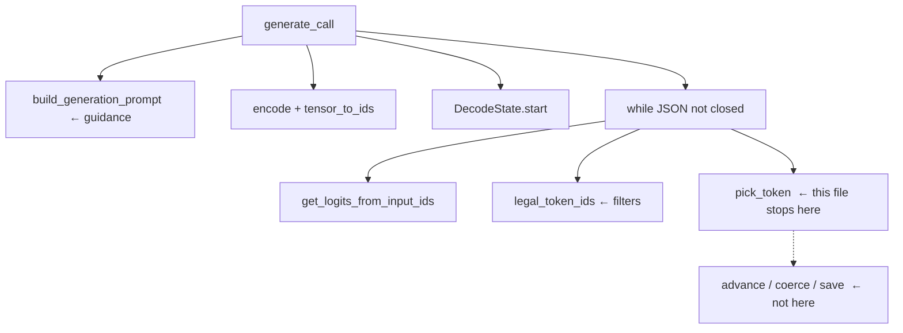
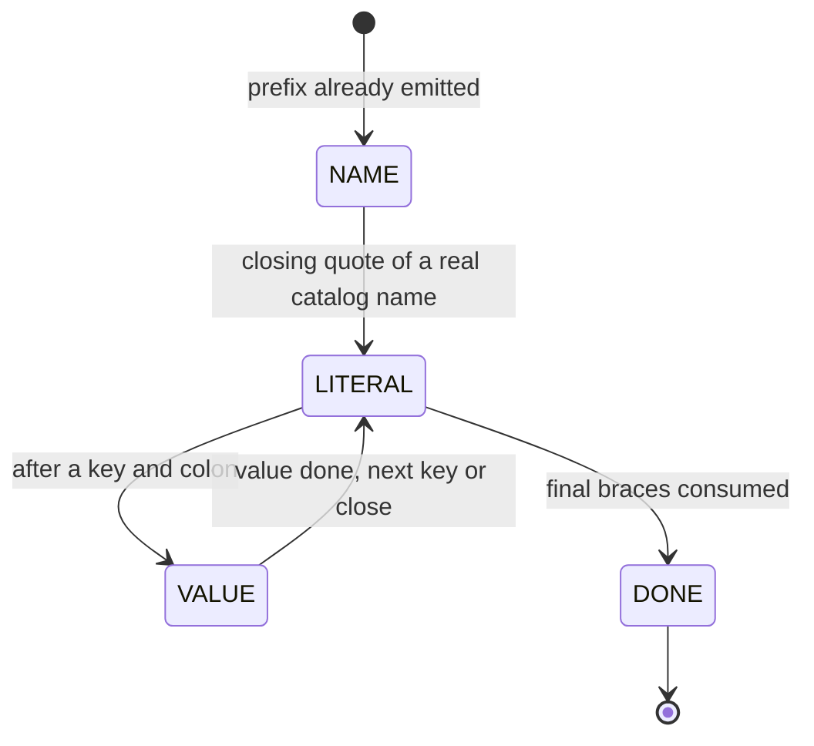
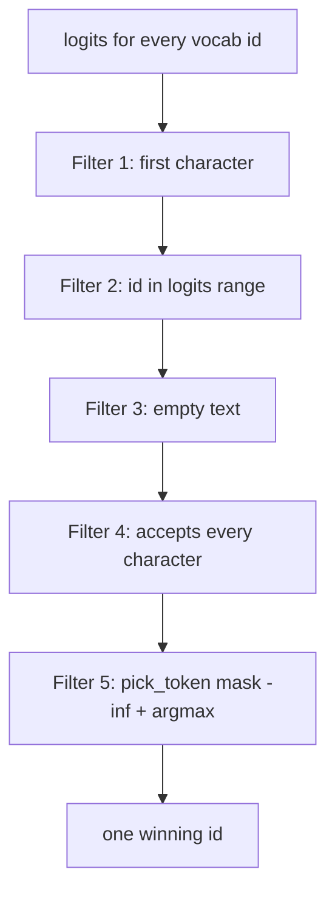

# Filtering legal tokens — from LLM guidance to the winning logit

This file is the slice of `generate_call` that **steers** the model, **scores**
every next token, **throws away illegal ids**, and **picks one logit**.

It stops at `pick_token`. It does **not** cover `DecodeState.advance`,
`coerce_parameters`, or writing `--output`. Those happen after the id is
chosen.

The same four calls run on every step of the loop. Token **ids** below are
illustrative. Token **text** is what the constraint machine sees.

---

## The example

**User prompt** (first object in `data/input/function_calling_tests.json`):

```text
What is the product of 3 and 5?
```

**Catalog** the model may name (from `functions_definition.json`):

| Name | Parameters |
|---|---|
| `fn_multiply_numbers` | `a: number`, `b: number` |
| `fn_is_even` | `n: integer` |
| `fn_calculate_compound_interest` | `principal: number`, `rate: number`, `years: integer` |
| `fn_execute_sql_query` | `query: string`, `database: string` |
| `fn_read_file` | `path: string`, `encoding: string` |
| `fn_format_template` | `template: string` |

What we want the decoder to write later (this file does not get that far):

```json
{
  "prompt": "What is the product of 3 and 5?",
  "name": "fn_multiply_numbers",
  "parameters": { "a": 3.0, "b": 5.0 }
}
```

The prefix `{"name":"` is already in the prompt. The loop only fills what
comes after that.

---

## Where this sits



| Function | File | Role in this slice |
|---|---|---|
| `generate_call` | `src/generate.py` | Builds the prompt, then runs the loop |
| `build_steering_prompt` | `src/prompt.py` | Instruction + catalog + user request |
| `build_generation_prompt` | `src/prompt.py` | Steering text + forced `{"name":"` |
| `Small_LLM_Model.encode` | `llm_sdk` | String → 2-D tensor of ids |
| `tensor_to_ids` | `src/generate.py` | Flatten to `list[int]` |
| `DecodeState.start` | `src/constraints.py` | Machine already at `{"name":"` |
| `get_logits_from_input_ids` | `llm_sdk` | Score every next-token id |
| `legal_token_ids` | `src/generate.py` | Keep only ids that stay on a valid JSON path |
| `allowed_first_chars` | `src/constraints.py` | Cheap first-character set |
| `Vocabulary.candidate_ids` | `src/vocabulary.py` | Ids whose text starts with those characters |
| `Vocabulary.text_of` | `src/vocabulary.py` | Id → the string that token would append |
| `DecodeState.accepts` | `src/constraints.py` | Trial-run every character, then restore |
| `pick_token` | `src/generate.py` | Illegal ids → `-inf`, then argmax |

The English in the prompt only **biases the logits**. The mask decides
**which ids may win**. There is no `if "product" in prompt`.

---

## 1 — Guide the LLM (the text it encodes)

Inside `generate_call`:

```python
prompt = build_generation_prompt(functions, user_prompt)
ids = tensor_to_ids(model.encode(prompt))
state = DecodeState.start(functions)
```

`build_generation_prompt` is steering plus `JSON_PREFIX`.
`build_steering_prompt` is the instruction, the full catalog, and the user
request. The SDK has no chat roles. `encode` receives one `str`.

```text
Translate the user request into a JSON function call.
Use exactly one function from the list below.

Available functions:
- fn_multiply_numbers: Multiply two numbers together and return their product.
  parameters: a: number, b: number
  returns: number
- fn_is_even: ...
...

User request:
What is the product of 3 and 5?

JSON function call:
{"name":"
```

That last line is `JSON_PREFIX` (`{"name":"`). The braces are **already
started**. The model is not asked to invent `{` or `"name":`. It only fills
holes.

| Piece of text | Who put it there | What it does |
|---|---|---|
| Instruction + “use exactly one function” | `build_steering_prompt` | Tells the model this is a function call, not prose |
| Catalog names, descriptions, types | `build_steering_prompt` | Gives the model enough English to prefer the right tool |
| User request | `build_steering_prompt` | The actual question |
| `{"name":"` | `JSON_PREFIX` | Forces the next tokens to start inside a JSON name |

This text only **steers** which legal function wins. It does not guarantee
JSON. The mask does that.

After encode:

- `ids` is the whole steering prompt as numbers. Each later token is
  **appended** to this list, so the next logits see the growing prefix.
- `state` starts in phase `NAME`. Next legal characters are prefixes of
  catalog names. Every current name starts with `fn_`, so the first
  allowed character is `f`.

```text
generated:  {"name":"
phase:      NAME
name_buffer: (empty)
chosen_index: None
```

The model still **chooses** among legal prefixes. After `fn_`, both
`fn_multiply_numbers` and `fn_is_even` (and the rest) are still possible.
A token starting with `z` never reaches argmax.

---

## Decode walkthrough — states and criteria

`DecodeState` is a **finite state machine**. It walks **characters**, not
tokens. The model emits a token (often several characters). `accepts`
feeds those characters one by one. A token is legal only if every
character is legal **in the state that is current when that character
arrives**. Mid-token, the machine may change state.



Four states. Extra memory (`name_buffer`, `literal_rest`, `kind`, number
and string flags) decides **which** characters are legal **inside** a
state.

How one token is tested, in every state:

```text
allowed_first_chars()          → cheap first-char set
candidate_ids(...)             → only those vocab ids
accepts(text)                  → snapshot, feed_char each char, restore
pick_token(logits, legal)      → illegal = -inf, argmax
```

`feed_char` is the transition function: `NAME` → `_feed_name`, `LITERAL`
→ `_feed_literal`, `VALUE` → `_feed_value` (then string / number / bool),
`DONE` → reject everything.

Below: the criteria for each state, then the same product prompt walked
through those states.

### State `NAME` — fill a catalog function name

**Where we are:** `generated` is `{"name":"`. The hole is the function
name, then `"`.

**Handler:** `_feed_name`

**Memory that matters:** `name_buffer` (what we have so far), the catalog
`functions` list.

**Legal:**

| Situation | Allowed next character |
|---|---|
| Buffer is a **prefix** of at least one catalog name, and that name still has leftover letters | The next letter of every still-matching name |
| Buffer **exactly equals** a catalog name | `"` only (closing quote) |

**Illegal:** any character that would make `name_buffer + char` a prefix
of **no** catalog name. Space, digits, `}`, prose. `"` is illegal until
the buffer is a **full** name (`fn_multiply` cannot close; `fn_multiply_numbers` can).

**Who chooses:** the LLM, among surviving prefixes. After `fn_`, `m`
(`multiply_numbers`), `i` (`is_even`), `c`, `e`, `r`, `f` are all legal.
The steering text should make `fn_multiply_numbers` win. The mask does
not know the word “product”.

**Exit:** `"` on an exact catalog name → `chosen_index` is set, phase
becomes `LITERAL`, `literal_rest = ',"parameters":{'`.

Walk on this prompt (plausible tokens; Qwen may split differently):

| After these tokens | `generated` | `name_buffer` | Still legal names | Next first chars |
|---|---|---|---|---|
| *(start)* | `{"name":"` | *(empty)* | all six | `{ "f" }` |
| `fn_` | `{"name":"fn_` | `fn_` | all six | `m i c e r f` |
| `multiply_numbers` | `{"name":"fn_multiply_numbers` | `fn_multiply_numbers` | that one only | `{ '"' }` |
| `"` | `{"name":"fn_multiply_numbers"` | same | frozen | leave `NAME` |

`fn_is_even` was legal until the model committed to `m`. `hello` and `3`
were never legal.

### State `LITERAL` — force structural JSON

**Where we are:** the next characters are **copied from a template**, not
chosen freely. Compact JSON: no spaces.

**Handler:** `_feed_literal`

**Memory that matters:** `literal_rest` (what still must be emitted),
`after_literal` (what to do when that string is empty).

**Legal:** exactly `literal_rest[0]`. Then the next character, in order.
A token may consume the whole fragment (`,"parameters":{`) if every
character matches.

**Illegal:** anything else. Space, `parameters` without the leading `,"`,
the wrong key, a value, a different quote style.

**Who chooses:** nobody useful. There is usually one legal path. The
model’s favorite token is almost always `-inf`.

**Exit:** `literal_rest` becomes empty → `_finish_literal`:

| `after_literal` | Next move |
|---|---|
| `FIRST_PARAM` | `_begin_param_or_close` — emit `"<first key>":` or `}}` if no keys |
| `START_VALUE` | `_begin_value` — enter `VALUE` with `kind` from the catalog |
| `DONE` | phase becomes `DONE` |

Keys come from the **chosen function**, in catalog order. The model does
not invent them.

Walk on this prompt after the name quote:

| `literal_rest` | Legal next char | After it is consumed |
|---|---|---|
| `,"parameters":{` | `,` | then `"parameters":{` one char at a time |
| *(empty, `FIRST_PARAM`)* | — | machine sets `literal_rest` to `"a":` |
| `"a":` | `"` | then `a":` |
| *(empty, `START_VALUE`)* | — | enter `VALUE`, `kind = NUMBER`, `param_index = 0` |

Later, after `a` is filled, the same state forces `,"b":`. After `b` is
filled, it forces `}}`.

```text
{"name":"fn_multiply_numbers","parameters":{"a":
                                           ^
                                           VALUE starts here
```

### State `VALUE` — fill one argument

**Where we are:** a catalog key and colon are already written. The hole
is the JSON value. `kind` is `normalize_kind` of that parameter’s type.

**Handler:** `_feed_value` → `_feed_number` / `_feed_string` / `_feed_bool`

**Memory that matters:** `kind`, `value_buffer`, `param_index`, plus the
number / string / bool flags. Last parameter vs not last decides the
terminator: `}` if last, `,` otherwise.

`VALUE` is one phase with **three rule sets**.

#### `VALUE` + `NUMBER` / `INTEGER`

Used for `a` and `b` on this prompt (`number`). `years` on compound
interest is `integer`.

**Legal, in order:**

| Buffer so far | Allowed next |
|---|---|
| empty | `-` or a digit |
| `-` | a digit (not another `-`, not a terminator) |
| digits, not complete | more digits; `.` only if `kind` is `NUMBER` and there is no `.` yet |
| `….` (dot, no fraction yet) | a digit only |
| complete number (`_number_complete`) | more digits (if under `_MAX_NUMBER`), optional `.` if still allowed, **or** the terminator |
| complete + last param | `}` |
| complete + more params left | `,` |

`_number_complete` means: at least one digit, and if there is a `.`, at
least one fraction digit.

**Illegal:** `"`, `true`, `+`, `.5`, `3e2`, `01`, a second `.`, `.` on an
`integer`, `,` on the last param, `}` when another param remains, a
25th digit (`_MAX_NUMBER` is 24).

**Who chooses:** the LLM, among legal JSON numbers. Steering should make
`3` beat `7` for `a`. `15` (the product) is a legal *number* here, but a
wrong value.

**Exit:** terminator accepted → `_commit_value` bumps `param_index`, then
`_begin_param_or_close` returns to `LITERAL` (`,"b":` or `}}`).

Walk for `a` (not last → terminator is `,`):

| Buffer | Legal first chars | Example legal tokens | Example illegal |
|---|---|---|---|
| empty | `-0123456789` | `3`, `3.0`, `-` | `"`, `true`, `fn` |
| `3` | digits, `.`, `,` | `.0`, `0`, `,` | `}`, `e`, `"` |
| `3.` | digits | `0`, `5` | `}`, `,`, `.` |

A token `3,"b":` is legal: `3` completes the number, `,` is re-fed into
the following `LITERAL`. A token `3}` is **illegal** here (`a` is not
last).

Walk for `b` (last → terminator is `}`):

| Buffer | Legal first chars | Example legal tokens | Example illegal |
|---|---|---|---|
| empty | `-0123456789` | `5`, `5.0` | `"`, `,` |
| `5` | digits, `.`, `}` | `}`, `.0` | `,` (would start another key) |

A token `5}}` is legal: `5` completes, first `}` starts the closer, second
`}` finishes it and the machine reaches `DONE`.

#### `VALUE` + `STRING`

Used for `query`, `database`, `path`, `encoding`, `template`. Same loop,
different `kind`.

**Legal:**

| Situation | Allowed next |
|---|---|
| string not open | `"` only |
| body open, not escaping | almost any char; `"` **closes**; `\` starts an escape; control chars (`ord < 0x20`) forbidden |
| after `\` | `" \ / b f n r t` or `u` |
| after `\u` | exactly 4 hex digits |
| body already 200 chars (`_MAX_STRING`) | `"` only |

**Illegal:** starting without `"`, raw tab/newline, `\x`, `\ug`, a 201st
body character.

**Who chooses:** the LLM, among legal JSON string pieces. While the body
is open, `allowed_first_chars` is `None` (scan the whole vocab). Filter 4
still kills control characters and over-long strings.

**Exit:** closing `"` → `_commit_value` → back to `LITERAL`.

#### `VALUE` + `BOOLEAN`

Not used by the current catalog **arguments** (a return type may be
boolean). Same machine.

**Legal:** the next character of `true` or `false`, then the terminator
once the word is complete.

**Illegal:** `yes`, `1`, `"true"`, `talse`, a terminator before the word
is finished.

### State `DONE` — object closed

**Where we are:** `generated` is a complete JSON object. `is_complete()`
is true. The `while` loop stops.

**Legal:** nothing. `allowed_first_chars` is empty. `feed_char` returns
False.

**Exit:** none. Decoding of this prompt is finished.

On the happy path for this example:

```text
generated: {"name":"fn_multiply_numbers","parameters":{"a":3,"b":5}}
phase:     DONE
```

### Prompt and machine state at each stage

Two strings grow. Do not mix them up.

| String | What it is | Who reads it |
|---|---|---|
| The **encoded prompt** (`ids`) | Steering text + the growing JSON. This is what the LLM scores. | `get_logits_from_input_ids` |
| `state.generated` | Only the JSON object, starting at `{"name":"` | `DecodeState` / `json.loads` later |

The steering block **never changes** after encode. Each chosen token is
appended to `ids` and to `generated`. Below, the steering is shown once,
then only the JSON line is repeated so you can see the hole move.

Steering (constant, already in `ids` at every stage):

```text
Translate the user request into a JSON function call.
Use exactly one function from the list below.

Available functions:
- fn_multiply_numbers: Multiply two numbers together ...
  parameters: a: number, b: number
  returns: number
- fn_is_even: ...
- fn_calculate_compound_interest: ...
- fn_execute_sql_query: ...
- fn_read_file: ...
- fn_format_template: ...

User request:
What is the product of 3 and 5?

JSON function call:
```

The caret `^` is the next hole. Token splits are illustrative.

#### Stage 0 — `NAME` (start)

What the model sees at the end of the prompt:

```text
JSON function call:
{"name":"
         ^
```

```text
phase:         NAME
generated:     {"name":"
name_buffer:
chosen_index:  None
literal_rest:
kind:          (unused)
param_index:   0
```

Legal next: prefixes of catalog names. First char is `f`.

#### Stage 1 — `NAME` (shared prefix)

After a token such as `fn_`:

```text
JSON function call:
{"name":"fn_
            ^
```

```text
phase:         NAME
generated:     {"name":"fn_
name_buffer:   fn_
chosen_index:  None
```

Legal next: `m` `i` `c` `e` `r` `f` (multiply / is_even / calculate /
execute / read / format). All six names are still possible.

#### Stage 2 — `NAME` (name complete, quote still open)

After `multiply_numbers`:

```text
JSON function call:
{"name":"fn_multiply_numbers
                            ^
```

```text
phase:         NAME
generated:     {"name":"fn_multiply_numbers
name_buffer:   fn_multiply_numbers
chosen_index:  None
```

Legal next: `"` only. The name matches catalog[0]. The quote has not
been accepted, so the function is not frozen yet.

#### Stage 3 — `LITERAL` (force `,"parameters":{`)

After `"`:

```text
JSON function call:
{"name":"fn_multiply_numbers"
                             ^
```

```text
phase:         LITERAL
generated:     {"name":"fn_multiply_numbers"
name_buffer:   fn_multiply_numbers
chosen_index:  0
literal_rest:  ,"parameters":{
after_literal: FIRST_PARAM
```

Legal next: `,` then the rest of `,"parameters":{`. No spaces.

#### Stage 4 — `LITERAL` (force first key `"a":`)

After `,"parameters":{` is consumed, the machine immediately loads the
first catalog key. Same `LITERAL` state, new `literal_rest`:

```text
JSON function call:
{"name":"fn_multiply_numbers","parameters":{
                                           ^
```

```text
phase:         LITERAL
generated:     {"name":"fn_multiply_numbers","parameters":{
chosen_index:  0
literal_rest:  "a":
after_literal: START_VALUE
param_index:   0
```

Legal next: `"` then `a":`. The key is copied from the catalog.

#### Stage 5 — `VALUE` (fill `a`)

After `"a":`:

```text
JSON function call:
{"name":"fn_multiply_numbers","parameters":{"a":
                                               ^
```

```text
phase:         VALUE
generated:     {"name":"fn_multiply_numbers","parameters":{"a":
kind:          NUMBER
value_buffer:
param_index:   0
```

Legal next: `-` or a digit. Terminator later will be `,` (`a` is not
last). Steering should make `3` win.

#### Stage 6 — `LITERAL` (force `,"b":`)

After `3` (number complete + comma starts the next literal):

```text
JSON function call:
{"name":"fn_multiply_numbers","parameters":{"a":3
                                                ^
```

```text
phase:         LITERAL
generated:     {"name":"fn_multiply_numbers","parameters":{"a":3
kind:          NUMBER          (stale until next _begin_value)
value_buffer:  3               (stale until next _begin_value)
param_index:   1
literal_rest:  ,"b":
after_literal: START_VALUE
```

Legal next: `,` then `"b":`.

If the winning token was `3,` or `3,"b":`, some of this literal is
already inside `generated`. The hole is whatever `literal_rest` still
holds.

#### Stage 7 — `VALUE` (fill `b`)

After `,"b":`:

```text
JSON function call:
{"name":"fn_multiply_numbers","parameters":{"a":3,"b":
                                                     ^
```

```text
phase:         VALUE
generated:     {"name":"fn_multiply_numbers","parameters":{"a":3,"b":
kind:          NUMBER
value_buffer:
param_index:   1
```

Legal next: `-` or a digit. Terminator later will be `}` (`b` is last).
Steering should make `5` win.

#### Stage 8 — `LITERAL` (force `}}`)

After `5` (number complete + `}` starts the closer):

```text
JSON function call:
{"name":"fn_multiply_numbers","parameters":{"a":3,"b":5
                                                      ^
```

```text
phase:         LITERAL
generated:     {"name":"fn_multiply_numbers","parameters":{"a":3,"b":5
param_index:   2
literal_rest:  }}
after_literal: DONE
```

Legal next: `}` then `}`. First brace closes `parameters`, second closes
the object.

#### Stage 9 — `DONE`

After `}}`:

```text
JSON function call:
{"name":"fn_multiply_numbers","parameters":{"a":3,"b":5}}
                                                        ^
                                                        (no hole)
```

```text
phase:         DONE
generated:     {"name":"fn_multiply_numbers","parameters":{"a":3,"b":5}}
is_complete:   True
```

Legal next: nothing. The loop stops. The steering text is still sitting
in `ids` above this line; `json.loads` only parses `generated`.

### One-line view of the same walk

Token splits are illustrative. Criteria do not change if Qwen emits
`fn_multiply_numbers` as one token or as `fn` + `_multiply` + `_numbers`.

| Stage | State | End of the prompt (`generated`) | Next hole |
|---|---|---|---|
| 0 | `NAME` | `{"name":"` | catalog name |
| 1 | `NAME` | `{"name":"fn_` | rest of a catalog name |
| 2 | `NAME` | `{"name":"fn_multiply_numbers` | `"` |
| 3 | `LITERAL` | `{"name":"fn_multiply_numbers"` | `,"parameters":{` |
| 4 | `LITERAL` | `…,"parameters":{` | `"a":` |
| 5 | `VALUE` | `…{"a":` | JSON number |
| 6 | `LITERAL` | `…{"a":3` | `,"b":` |
| 7 | `VALUE` | `…,"b":` | JSON number |
| 8 | `LITERAL` | `…,"b":5` | `}}` |
| 9 | `DONE` | `…{"a":3,"b":5}}` | — |

Same stages, other prompts: `fn_is_even` uses `VALUE` + `INTEGER` for
`n` (no `.`). `fn_read_file` uses `VALUE` + `STRING` twice. The JSON
line in the prompt just has different keys and value shapes. The state
graph does not change.

---

## 2 — Ask for logits

Each step of the loop:

```python
logits = model.get_logits_from_input_ids(ids)
legal = legal_token_ids(state, vocab, len(logits))
token_id = pick_token(logits, legal)
```

`get_logits_from_input_ids` scores **every** vocab id for “what comes next”.
That is a `list[float]`, one score per id. Higher means the model likes
that token more, given the steering text and everything already appended.

Logits are **not** in `vocab`. `vocab` only answers “id 20 is the string
`3`”. The scores appear here, one list per step.

Most of those ~150k ids are illegal right now (`hello`, `}`, a space, a
digit while we are still in `NAME`). Filters 1–4 decide legality.
`pick_token` applies that list to the scores.



A token is **invalid** if it fails **any** filter. Later filters only see
what survived the earlier ones.

---

## 3 — Filter legal tokens (`legal_token_ids`)

```python
def legal_token_ids(state, vocab, vocab_size) -> list[int]:
    legal: list[int] = []
    for token_id in vocab.candidate_ids(state.allowed_first_chars()):
        if token_id >= vocab_size:
            continue
        if state.accepts(vocab.text_of(token_id)):
            legal.append(token_id)
    return legal
```

`accepts` walks **characters**. The model emits **tokens** (often several
characters). A token is legal only if every character in order is legal.

### Filter 1 — first character

**Where:** `legal_token_ids` → `vocab.candidate_ids(state.allowed_first_chars())`

Look only at tokens whose **first** character is still legal. Everyone
else is never tested with `accepts`.

This is a speed filter. It is not the full schema check.

`allowed_first_chars` depends on `phase`:

| Phase / situation | Allowed first chars | Example **valid** texts | Example **invalid** (dropped here) |
|---|---|---|---|
| `NAME`, buffer empty | `{ "f" }` (every catalog name starts with `fn_`) | `f`, `fn`, `fn_mul` | `3`, `}`, `hello`, space, `{` |
| `NAME`, buffer `fn_` | `{ "m", "i", "c", "e", "r", "f" }` from multiply / is_even / calculate / execute / read / format | `multiply`, `is_even`, `read` | `fn` (`f` is no longer allowed), `z`, `3` |
| `LITERAL`, rest `,"parameters":{` | `{ "," }` | `,` or `,"parameters"` | `"`, `p`, space, `a` |
| `LITERAL`, rest `"a":` | `{ '"' }` | `"`, `"a"` | `a` (no quote), `,`, `3` |
| `VALUE` number, empty | `-` and digits | `3`, `3.0`, `-` | `"`, `true`, `fn`, `{` |
| `VALUE` number, already `3` | more digits, `.` (if `number`), and `,` or `}` | `.0`, `5`, `}` if last arg | `"`, `e`, `+` |
| `VALUE` integer | `-` and digits; no `.` | `23`, `-` | `.`, `3.5` (first char `.` is dropped; `3.5` dies in Filter 4) |
| `VALUE` string, not open | `{ '"' }` | `"` | `s`, `SELECT`, `3` |
| `VALUE` string, body open | `None` → scan **all** ids | almost anything | nothing dropped **by this filter** |
| `VALUE` bool, empty | `{ "t", "f" }` | `true`, `t`, `false` | `1`, `"`, `yes` |
| `DONE` | empty set | — | everything |

**Why a token dies here:** its text starts with the wrong character, so it
cannot be the next piece of the template.

**False friends:** a token can **pass** this filter and still die in
`accepts`. Example: first char is `f`, token is `foo`. Filter 1 keeps it
during `NAME`. Filter 4 rejects it because no catalog name starts with
`foo`.

`candidate_ids`:

- given a set of characters → union of `vocab.by_first[char]`
- given `None` (open string body) → `vocab.all_ids`

### Filter 2 — id must fit the logits vector

**Where:** `if token_id >= vocab_size: continue`

`vocab_size` is `len(logits)`.

**Invalid when:** the vocab file has an id that this forward pass did not
score. You cannot read `logits[that_id]`.

This is a safety cut, not a JSON rule.

### Filter 3 — empty text

**Where:** `DecodeState.accepts` starts with `if not text: return False`

**Invalid when:** `vocab.text_of(id)` is `""`.

That happens if the vocab piece is not valid UTF-8 after the byte map
(`token_piece_to_text`), or the id is unknown. There is no character to
feed, so the token cannot advance the machine.

### Filter 4 — every character must be legal (`accepts`)

**Where:** `state.accepts(vocab.text_of(token_id))`

Snapshot the machine (`_snapshot`), call `feed_char` for **each**
character, restore (`_restore`). A rejected trial does nothing to the
real state.

A token is invalid if **any** character fails, even if the first ones
succeed. The character rules depend on `phase`.

#### 4a — `NAME` (`_feed_name`)

We are filling the function name, or its closing quote.

**Valid:** next character still matches at least one catalog name, or `"`
when the buffer **exactly** equals a catalog name.

**Invalid:**

| Current `name_buffer` | Token / char | Why invalid |
|---|---|---|
| `""` | `multiply` | no name starts with `multiply` (they start with `fn_`) |
| `fn_` | `z` | no `fn_z…` in the catalog |
| `fn_` | space | names have no space |
| `fn_multiply` | `"` | `fn_multiply` is not a full catalog name |
| `fn_is_even` | `_` | `fn_is_even_` is not a prefix of `fn_is_even` |
| `fn_foo` | `"` | quote is only legal when the buffer **equals** a real name |

After `fn_`, `m` (`multiply_numbers`) and `i` (`is_even`) are both valid.
The LLM chooses among those prefixes. `hello` is invalid.

When `"` is accepted on a real name, `chosen_index` is set and the machine
switches to `LITERAL` with `literal_rest = ',"parameters":{'`.

#### 4b — `LITERAL` (`_feed_literal`)

The next characters are **forced**. Only `literal_rest[0]`, then the next,
in order. Compact JSON: no spaces.

Example after the name quote: `literal_rest = ',"parameters":{'`

| Token | Valid? | Why |
|---|---|---|
| `,` | yes | first forced char |
| `,"parameters":{` | yes | whole fragment, in order |
| space | no | not the next forced char |
| `parameters` | no | missing the leading `,` and `"` |
| `:` | no | we are not at the colon yet |
| `{` | no | first char must be `,` |

After `{`, `_begin_param_or_close` copies the **next catalog key** into
`literal_rest` (first key has no leading comma). For
`fn_multiply_numbers` that is `"a":`. Then `b` or `"b"` is invalid: the
first key is `a`, in catalog order. The model does not invent keys.

When there are no keys left, `literal_rest` becomes `}}`.

#### 4c — `VALUE` number / integer (`_feed_number`)

Used for `a` / `b` on this prompt (`number`). `years` on compound interest
is `integer`.

**Valid pieces:** optional `-`, digits, at most one `.` plus fraction
digits (`number` only). When the number is complete, `,` (more params) or
`}` (last param).

**Invalid:**

| Buffer so far | Token | Why invalid |
|---|---|---|
| `""` | `"3"` or `"` | strings are not numbers |
| `""` | `true` | boolean, not a number |
| `""` | `+3` | JSON numbers do not start with `+` |
| `""` | `.5` | need a digit before `.` |
| `-` | `,` or `}` | not complete (`_number_complete` needs a digit) |
| `3` | `e` / `E` | no scientific notation |
| `3.` | `}` | `.` with no fraction digit yet |
| `3` | `.` if kind is `integer` | integers cannot have a `.` |
| `0` | `1` | leading zero: `01` is not valid JSON |
| `3` | `,` when this is the **last** param | last param must terminate with `}` |
| `3` | `}` when another param remains | not last: must use `,` then `"b":` |
| 24+ digit body | another digit | `_MAX_NUMBER` |

**Valid even if it looks “too long”:** token `3,"b":` — `3` finishes the
number, `,` is re-dispatched into the next literal. Token `5}` on the
**last** argument is valid for the same reason.

#### 4d — `VALUE` string (`_feed_string`)

Used later for `fn_execute_sql_query`, `fn_read_file`,
`fn_format_template`. Same loop, different `kind`.

**Invalid:**

| Situation | Token | Why invalid |
|---|---|---|
| string not open | `SELECT` | must start with `"` |
| string not open | `3` | not a quote |
| after `\` | `x` | only `" \ / b f n r t` or `u` |
| after `\u` | `g` | need 4 hex digits |
| body open | a control char (`ord < 0x20`) | not allowed unescaped |
| 200 chars already | another letter | `_MAX_STRING`; only `"` remains legal |

**Valid examples:** `"`, `SELECT`, `"SELECT * FROM users"`, `\"`, `\n`,
`\u0041`.

While the body is open, Filter 1 does **not** help (`first_chars is None`).
Almost every id reaches `accepts`. Control characters and over-long
strings still die here.

#### 4e — `VALUE` boolean (`_feed_bool`)

Not used by the current catalog values (returns may be boolean; arguments
are not). Same filter exists.

Only prefixes of `true` / `false`, then the terminator. `yes`, `1`, and
`"true"` are illegal.

#### 4f — tokens that span a phase change

`accepts` walks the **whole** token. Mid-token phase changes are allowed
if every character is legal **in sequence**.

| Token | Context | Valid? | Why |
|---|---|---|---|
| `fn_multiply_numbers"` | `NAME` | yes | name then closing quote |
| `3,` | not last number (`a`) | yes | digit, then comma before `"b":` |
| `3}` | **not** last | no | `}` is not the terminator for `a` |
| `5}` | last number (`b`) | yes | digit, then `}` starts `}}` |
| `5}}` | last number | yes | value + both closing braces |
| `3.}` | number | no | `}` while fraction is missing |
| `,"parameters":{"a":3` | just after name quote | yes | literal + start of value |
| ` multiply` (leading space) | `NAME` | no | space is not in any name |

**Invalid for spanning tokens:** the prefix is legal, the **rest** is not.
Filter 1 may still keep the token (first char was fine). Filter 4 kills it.

---

## 4 — Choose the correct logit (`pick_token`)

This is the last step in this file.

```python
def pick_token(logits: list[float], legal: list[int]) -> int | None:
    if not legal:
        return None
    scores = np.asarray(logits, dtype=np.float64)
    masked = np.full(len(scores), -np.inf)
    valid = [id for id in legal if 0 <= id < len(scores)]
    masked[valid] = scores[valid]
    chosen = int(np.argmax(masked))
    if not np.isfinite(masked[chosen]):
        return None
    return chosen
```

Filters 1–4 decide **legality**. Filter 5 decides **which legal token
wins**.

There is no new JSON rule here. Illegal ids become `-inf`. Argmax then
runs on the copy. A high raw logit for `hello` cannot win while we are
in `NAME`.

| Token | Model might like it | After mask |
|---|---|---|
| ` The product is` | high logit (prose) | `-inf` — failed Filter 1 or 4 |
| `15` as the **answer** | high | `-inf` during `NAME` (not a function name) |
| space / newline | often high | `-inf` in `LITERAL` (no whitespace) |
| `fn_multiply_numbers` | medium / high on this prompt | kept, can win during `NAME` |
| `fn_is_even` | lower for a “product” prompt | **kept** during `NAME` (legal). Argmax can still pick it if its legal score is highest |

Important: **`fn_is_even` is not invalid** on a product prompt. The mask
does not know English. It only knows catalog prefixes. The steering text
is what should make `fn_multiply_numbers` outscore the other legal names.
Wrong-but-legal names can still win. That is an accuracy miss, not a JSON
error.

`pick_token` returns `None` when `legal` is empty (or every remaining
score is non-finite). The loop then breaks. That is **after** this file’s
scope (`_emergency_finish` is not covered here).

Who chose what, up to this point:

| Piece | Who chooses it | How |
|---|---|---|
| `{"name":"` | Decoder | already in the prompt |
| Function name | LLM, among catalog prefixes | highest **legal** logit |
| `,"parameters":{"a":` | Decoder | forced literal + first catalog key |
| `3` | LLM, among legal JSON numbers | highest **legal** logit |
| `,"b":` | Decoder | forced literal + second catalog key |
| `5` | LLM, among legal JSON numbers | highest **legal** logit |
| `}}` | Decoder | forced close |

The LLM only chooses among survivors. Guidance (section 1) biases which
survivor has the biggest remaining logit. The mask makes every other id
lose.

---

## One step, all filters, concrete picture

State at the first generated token:

```text
generated: {"name":"
phase:     NAME
name_buffer: (empty)
```

The steering prompt (product of 3 and 5, catalog listed) is already in
`ids`. The model scores (made up):

| id | text | raw logit |
|---|---|---|
| 10 | `fn_mul` | 4.1 |
| 11 | `fn_is` | 1.2 |
| 20 | `3` | 3.0 |
| 30 | `hello` | 5.9 |
| 40 | `}` | 0.4 |
| 50 | `foo` | 2.0 |

**Filter 1:** allowed first char = `f`. Drop `3`, `hello`, `}`. Keep
`fn_mul`, `fn_is`, `foo`.

**Filter 2:** all ids in range. Keep those three.

**Filter 3:** all have text. Keep those three.

**Filter 4:**

- `fn_mul` → `f`,`n`,`_`,`m`,`u`,`l` all prefixes of `fn_multiply_numbers` → **valid**
- `fn_is` → prefixes of `fn_is_even` → **valid**
- `foo` → `f` ok, `o` → `fo` is not a catalog prefix → **invalid**

**Filter 5:** mask. `hello` had the highest raw logit (5.9) but is `-inf`.
Winner is `fn_mul` (4.1).

That is the chosen logit. This file stops here.

On the next iteration the same five filters run again: new logits from
the longer `ids`, a tighter first-char set (`t` from `tiply_numbers` if
the buffer is now `fn_mul`), then another `pick_token`.

---

## Later in the same prompt (same filters, different first chars)

After the name is closed:

```text
generated: {"name":"fn_multiply_numbers"
phase:     LITERAL
literal_rest: ,"parameters":{
```

Now `hello` and `fn_mul` both fail Filter 1 (first char must be `,`).
`3` fails Filter 1. Only comma-leading tokens reach `accepts`. The
steering text barely matters: there is usually only one legal path.

When filling `a`:

```text
generated: {"name":"fn_multiply_numbers","parameters":{"a":
phase:     VALUE  (number)
```

`fn_mul` fails Filter 1. `"hello"` fails Filter 1. `3` and `3.0` pass.
`true` fails Filter 1 (`t` is not a digit or `-`). Among legal number
tokens, the steering text should make `3` outscore `7` or `12`.

---

## Quick map

| Step | Function | What it does |
|---|---|---|
| Guide | `build_steering_prompt` / `build_generation_prompt` | Catalog + request + `{"name":"` |
| Encode | `encode` / `tensor_to_ids` | That string → input ids |
| Score | `get_logits_from_input_ids` | A float per vocab id |
| Filter 1 | `allowed_first_chars` + `candidate_ids` | Drop wrong first character |
| Filter 2 | `token_id >= vocab_size` | Drop ids the model did not score |
| Filter 3 | `accepts` early return | Drop empty decoded text |
| Filter 4 | `accepts` → `feed_char` | Drop any token that breaks NAME / LITERAL / VALUE |
| Filter 5 | `pick_token` | Copy logits, illegal = `-inf`, argmax |

Guidance decides **which legal name or value looks best**.
Filters 1–4 decide **what is legal**.
`pick_token` decides **the winning id**.
