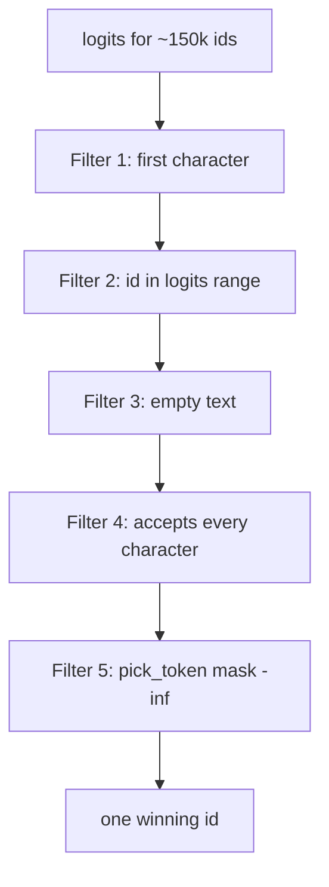

# Generation loop — filters and invalid tokens

This file is only the inner loop in `generate_call`. One prompt as the
running example:

```text
What is the sum of 2 and 3?
```

Target (compact, no extra spaces):

```text
{"name":"fn_add_numbers","parameters":{"a":2,"b":3}}
```

The prefix `{"name":"` is already in the prompt. The loop only fills what
comes after that.

Token **ids** below are fake. Token **text** is what matters.

---

## The loop

```python
while not state.is_complete() and new_tokens < _MAX_NEW_TOKENS:
    logits = model.get_logits_from_input_ids(ids)
    legal = legal_token_ids(state, vocab, len(logits))
    token_id = pick_token(logits, legal)
    if token_id is None:
        break
    state.advance(vocab.text_of(token_id))
    ids.append(token_id)
```

Each step the model scores **every** vocab id. Most are thrown away by
filters, then argmax runs on what remains.



A token is **invalid** if it fails **any** filter. The later filters only
see what survived the earlier ones.

---

## Filter 1 — first character (`allowed_first_chars` + `candidate_ids`)

**Where:** `legal_token_ids` → `vocab.candidate_ids(state.allowed_first_chars())`

**What it does:** look only at tokens whose **first** character is still
legal. Everyone else is never tested with `accepts`.

This is a speed filter. It is not the full schema check.

| Phase / situation | Allowed first chars | Example **valid** token texts | Example **invalid** (dropped here) |
|---|---|---|---|
| `NAME`, buffer empty | `{ "f" }` (all names start with `fn_`) | `f`, `fn`, `fn_add` | `2`, `}`, `hello`, space, `{` |
| `NAME`, buffer `fn_` | `{ "a", "g", "r", "s" }` from `add` / `get` / `reverse` / `substitute` (and `greet`) | `add`, `get`, `greet` | `fn` (starts with `f`, but wait — `f` is **not** in the allowed set now, so `fn` is dropped **here**) |
| `LITERAL`, rest `,"parameters":{` | `{ "," }` | `,` or `,"parameters"` | `"`, `p`, space, `a` |
| `LITERAL`, rest `"a":` | `{ '"' }` | `"`, `"a"` | `a` (no quote), `,`, `2` |
| `VALUE` number, empty | `-` and digits | `2`, `2.0`, `-` | `"`, `true`, `fn`, `{` |
| `VALUE` number, already `2` | more digits, `.` (if `number`), and `,` or `}` | `.0`, `5`, `}` if last arg | `"`, `e`, `+` |
| `VALUE` string, not open | `{ '"' }` | `"` | `s`, `shrek`, `2` |
| `VALUE` string, body open | `None` → scan **all** ids | almost anything | nothing dropped **by this filter** |
| `VALUE` bool, empty | `{ "t", "f" }` | `true`, `t`, `false` | `1`, `"`, `yes` |
| `VALUE` bool, buffer `tru` | `{ "e" }` | `e` | `t`, `false`, `a` |
| `DONE` | empty set | — | everything |

**Why a token dies here:** its text starts with the wrong character, so it
cannot be the next piece of the template.

**False friends:** a token can **pass** this filter and still die in
`accepts`. Example: first char is `f`, token is `foo`. Filter 1 keeps it
during `NAME`. Filter 4 rejects it because no catalog name starts with
`foo`.

---

## Filter 2 — id must fit the logits vector

**Where:** `if token_id >= vocab_size: continue`

`vocab_size` is `len(logits)`.

**Invalid when:** the vocab file has an id that the current forward pass
did not score (tokenizer extras, special tokens past the logit length).

**Example:** vocab maps id `151666` → some piece, but `logits` has length
`151936` or the opposite — if `151666 >= len(logits)`, skip it. You cannot
read `logits[151666]`.

This is a safety cut, not a JSON rule.

---

## Filter 3 — empty text

**Where:** `DecodeState.accepts` starts with `if not text: return False`

**Invalid when:** `vocab.text_of(id)` is `""`.

That happens if the vocab piece is not valid UTF-8 after the byte map, or
the id is unknown.

**Example:** a broken / non-UTF-8 BPE piece. There is no character to feed,
so the token cannot advance the machine.

---

## Filter 4 — every character must be legal (`accepts`)

**Where:** `state.accepts(vocab.text_of(token_id))`

Snapshot the machine, call `feed_char` for **each** character, restore.

A token is invalid if **any** character fails, even if the first ones
succeed.

| Token text | Why it fails `accepts` |
|---|---|
| `2}` while still in `NAME` | `2` is not a prefix of any function name |
| `fn_add_numbers",` | `"` is ok and ends the name, then `,` is ok for the literal — this one can **pass** |
| `fn_add_numbers}` | after `"` the next forced char is `,` not `}` |
| `add` when buffer is already `fn_get` | `fn_getadd` is not a catalog prefix |

The character rules depend on `phase`. Those are the sub-filters below.

### 4a — `NAME` (`_feed_name`)

We are filling the function name (or its closing quote).

**Valid:** next character still matches at least one catalog name, or `"`
when the buffer **exactly** equals a catalog name.

**Invalid:**

| Current `name_buffer` | Token / char | Why invalid |
|---|---|---|
| `""` | `add` | no name starts with `add` (they start with `fn_`) |
| `fn_` | `z` | no `fn_z…` in the catalog |
| `fn_` | ` ` (space) | names have no space |
| `fn_add` | `"` | `fn_add` is not a full catalog name (`fn_add_numbers` is) |
| `fn_add_numbersX` | anything | already off every prefix; nothing can save it |
| `fn_greet` | `_` | `fn_greet_` is not a prefix of `fn_greet` |
| `fn_foo` (typo) | `"` | quote is only legal when the buffer **equals** a real name |

After `fn_`, `a` (`add_numbers`) and `g` (`greet`, `get_square_root`) are
both valid. The LLM chooses. `hello` is invalid.

### 4b — `LITERAL` (`_feed_literal`)

The next characters are **forced**. Only `literal_rest[0]`, then the next,
in order.

Example after the name quote: `literal_rest = ',"parameters":{'`

| Token | Valid? | Why |
|---|---|---|
| `,` | yes | first forced char |
| `,"parameters":{` | yes | whole fragment, in order |
| `,"parameters":{"a":` | yes if that is the next fragment after `{` — actually after `{` the machine switches and then forces `"a":`, so a token that **spans** `{` then `"` can pass `accepts` |
| ` ` (space) | no | compact JSON, no spaces |
| `parameters` | no | missing the leading `,` and `"` |
| `:` | no | we are not at the colon yet |
| `{` | no | first char must be `,` |

**Invalid means:** this token would insert a character that is not the next
one in the forced string.

After `{`, `_begin_param_or_close` sets `literal_rest` to `"a":` (first
key of `fn_add_numbers`). Then `b` or `"b"` is invalid: the first key is
`a`, in catalog order.

### 4c — `VALUE` number / integer (`_feed_number`)

Catalog type for `a` and `b` is `number`.

**Valid pieces:** optional `-`, digits, at most one `.` plus fraction
digits (`number` only). When the number is complete, `,` (more params) or
`}` (last param).

**Invalid:**

| Buffer so far | Token | Why invalid |
|---|---|---|
| `""` | `"2"` or `"` | strings are not numbers |
| `""` | `true` | boolean, not a number |
| `""` | `+2` | JSON numbers do not start with `+` |
| `""` | `.5` | need a digit before `.` |
| `""` | `--` | second `-` not allowed |
| `-` | `,` or `}` | number not complete (`_number_complete` needs a digit) |
| `2` | `e` / `E` | no scientific notation in this decoder |
| `2` | `+` | no exponent |
| `2` | `" ` | quote is not a terminator (terminators are `,` or `}`) |
| `2.` | `}` | `.` with no fraction digit yet |
| `2` | `.` if kind is `integer` | integers cannot have a `.` |
| `0` | `1` | leading zero: `01` is not valid JSON |
| `2` | `,` when this is the **last** param | last param must terminate with `}`, not `,` |
| `2` | `}` when another param remains | not last: must use `,` then `"b":` |
| long 24+ digit body | another digit | `_MAX_NUMBER` (24) |

**Valid even if it looks “too long”:** token `2,"b":` — `2` finishes the
number, `,` is re-dispatched into the next literal. `accepts` walks every
char. Token `2}` on the **last** argument is valid for the same reason.

### 4d — `VALUE` string (`_feed_string`)

Used for `fn_greet` / `fn_reverse_string`, not for this sum prompt. Same
loop, different `kind`.

**Invalid:**

| Situation | Token | Why invalid |
|---|---|---|
| string not open | `shrek` | must start with `"` |
| string not open | `2` | not a quote |
| body open | raw `"` inside the name | `"` **closes** the string (that part is valid) but a token `shrek"extra` then fails after close |
| body open | a control char (tab, newline, `ord < 0x20`) | not allowed unescaped |
| after `\` | `x` | only `" \ / b f n r t` or `u` |
| after `\u` | `g` | need 4 hex digits |
| after `\u00` | `zz` | not hex |
| 200 chars already | another letter | `_MAX_STRING`; only `"` remains legal |

**Valid examples:** `"`, `shrek`, `"shrek"`, `\"`, `\n`, `\u0041`.

While the body is open, Filter 1 does **not** help (`first_chars is None`).
Almost every id reaches `accepts`. Control characters and over-long
strings still die here.

### 4e — `VALUE` boolean (`_feed_bool`)

Not used by the sample catalog, but the same filter exists.

| Buffer | Token | Why invalid |
|---|---|---|
| `""` | `yes` / `1` / `"true"` | only prefixes of `true` or `false` |
| `t` | `alse` | `talse` is not a prefix of `true` or `false` |
| `tru` | `th` | `truth` is not `true` |
| `tr` | `}` | not finished (`true` / `false` incomplete) |
| `true` | `,` on last param | last param terminator is `}` |

**Valid:** `t`, `tr`, `true`, `false`, then the terminator.

### 4f — `DONE`

Any extra token is invalid. The object is already closed. The loop should
have stopped via `is_complete()`.

### 4g — tokens that span a phase change

`accepts` walks the **whole** token. Mid-token phase changes are allowed
if every character is legal **in sequence**.

| Token | Context | Valid? | Why |
|---|---|---|---|
| `fn_add_numbers"` | `NAME` | yes | name then closing quote |
| `2}` | last number, complete | yes | digit, then `}` starts `}}` |
| `2,` | not last number | yes | digit, then comma before `"b":` |
| `2}` | **not** last (`a` still needs `b`) | no | `}` is not the terminator for `a` |
| `3}}` | last number | yes | value + both closing braces |
| `2.}` | number | no | `}` while fraction is missing |
| `,"parameters":{"a":2` | just after name quote | yes | literal + start of value |
| ` add` (leading space) | `NAME` | no | space is not in any name |

**Invalid for spanning tokens:** the prefix is legal, the **rest** is not.
Filter 1 may still keep the token (first char was fine). Filter 4 kills it.

---

## Filter 5 — logit mask (`pick_token`)

**Where:** after `legal` is built.

```python
masked = all -inf
masked[legal] = logits[legal]
chosen = argmax(masked)
```

This is not a new JSON rule. It **applies** the earlier filters to the
scores.

**Invalid here means:** the token is not in `legal` (or the id is outside
`0 … len(logits)-1`). Its score becomes `-inf`, so it can never win.

| Token | Model might like it | After mask |
|---|---|---|
| ` The sum is` | high logit (prose) | `-inf` — failed Filter 1 or 4 |
| `42` as the **answer** | high | `-inf` during `NAME` (not a function name) |
| space / newline | often high | `-inf` in `LITERAL` (no whitespace) |
| `fn_add_numbers` | medium | kept, can win during `NAME` |
| `fn_greet` | lower for a “sum” prompt | **kept** during `NAME` (legal). Argmax can still pick it if its legal score is highest |

Important: **`fn_greet` is not invalid** on a sum prompt. The mask does
not know English. It only knows catalog prefixes. Wrong-but-legal names
can still win. That is an accuracy miss, not a JSON error.

`pick_token` returns `None` when `legal` is empty (or every remaining
score is non-finite). The loop then breaks and `_emergency_finish` tries
to close the template with forced characters.

---

## One step, all filters, concrete picture

State:

```text
generated: {"name":"
phase:     NAME
name_buffer: (empty)
```

Model scores (made up):

| id | text | raw logit |
|---|---|---|
| 10 | `fn_add` | 4.1 |
| 11 | `fn_greet` | 1.2 |
| 20 | `2` | 3.0 |
| 30 | `hello` | 5.9 |
| 40 | `}` | 0.4 |
| 50 | `foo` | 2.0 |

**Filter 1:** allowed first char = `f`. Drop `2`, `hello`, `}`. Keep
`fn_add`, `fn_greet`, `foo`.

**Filter 2:** all ids in range. Keep those three.

**Filter 3:** all have text. Keep those three.

**Filter 4:**

- `fn_add` → `f`,`n`,`_`,`a`,`d`,`d` all prefixes of `fn_add_numbers` → **valid**
- `fn_greet` → prefixes of `fn_greet` → **valid**
- `foo` → `f` ok, `o` → `fo` is not a catalog prefix → **invalid**

**Filter 5:** mask. `hello` had the highest raw logit (5.9) but is `-inf`.
Winner is `fn_add` (4.1).

Then `advance("fn_add")`, append id 10, next iteration.

---

## Later in the same prompt

After the name is closed:

```text
generated: {"name":"fn_add_numbers"
phase:     LITERAL
literal_rest: ,"parameters":{
```

Now `hello` and `fn_add` both fail Filter 1 (first char must be `,`).
`2` fails Filter 1. Only comma-leading tokens reach `accepts`.

When filling `a`:

```text
generated: {"name":"fn_add_numbers","parameters":{"a":
phase:     VALUE  (number)
```

`fn_add` fails Filter 1. `"hello"` fails Filter 1. `2` and `2.0` pass.
`true` fails Filter 1 (`t` is not a digit or `-`).

---

## Quick map

| Filter | Function | A token is invalid when |
|---|---|---|
| 1 first char | `allowed_first_chars` + `candidate_ids` | it starts with a character that cannot come next |
| 2 range | `token_id >= vocab_size` | the model did not produce a logit for that id |
| 3 empty | `accepts` early return | decoded text is `""` |
| 4 schema | `accepts` → `feed_char` | any character breaks NAME / LITERAL / VALUE rules |
| 5 mask | `pick_token` | it is not in the legal list, so score is `-inf` |

Filters 1–4 decide **legality**. Filter 5 decides **which legal token
wins**. The LLM only chooses among survivors.
