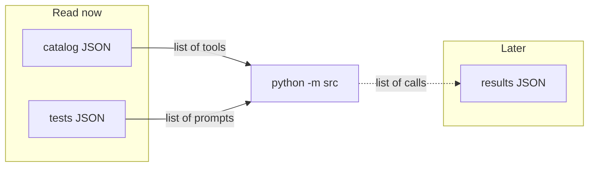
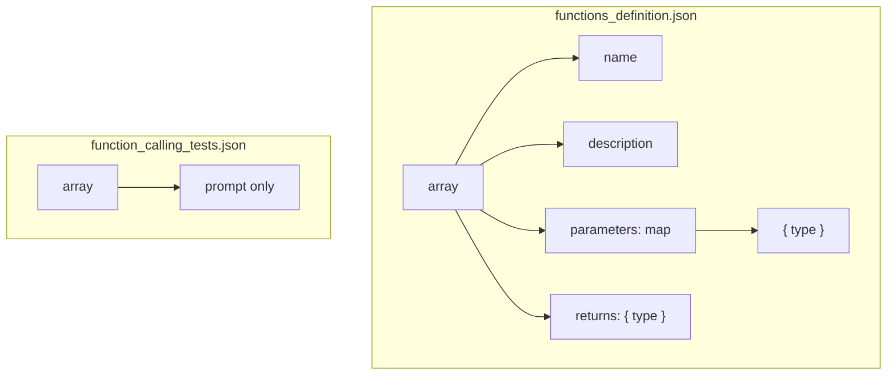
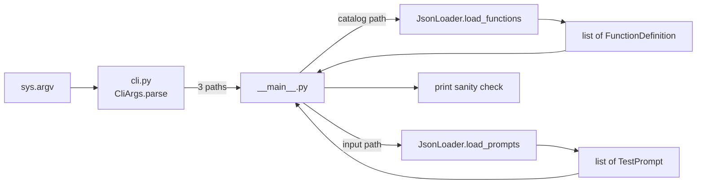
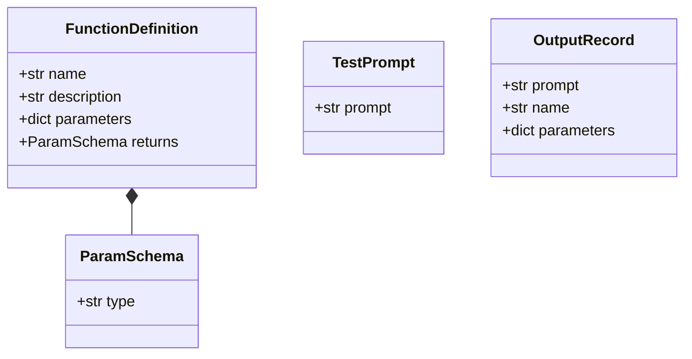
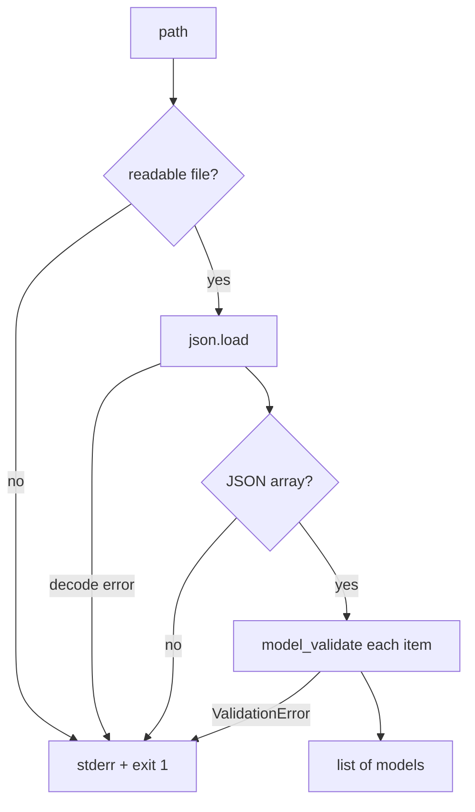

# Parsing

This document describes **phase 1 of the code as it exists now**: read two JSON files, validate them, print a sanity check. It does **not** call the LLM and it does **not** write the output file.

Run it:

```bash
uv run python -m src
uv run python -m src --help
```

---

## What “parsing” means here

The program must turn **disk files + command-line flags** into **typed Python objects**. After that, later code (not written yet) will turn each prompt into a function call.

There are **three paths**, only **two of which are read**:

| Role | Flag | Default in this repo | Now |
|---|---|---|---|
| Function catalog | `--functions_definition` | `data/input/functions_definition.json` | **Read + validate** |
| User prompts | `--input` | `data/input/function_calling_tests.json` | **Read + validate** |
| Results | `--output` | `data/output/function_calling_results.json` | Path stored only; **not written yet** |

Both inputs are JSON **arrays**. That is the only thing they share. The objects inside them have different fields, so they use **different pydantic models**.

Reviewers will change the JSON. Do not hardcode `fn_add_numbers` or the sample sentences. Trust the **schema**.



---

## The two input files

### Catalog — `--functions_definition`

**Meaning:** the menu of tools the model is allowed to name.

**Top level:** a JSON array.

**Each element:**

| Field | JSON type | Meaning |
|---|---|---|
| `name` | string | Tool id (`fn_add_numbers`, …) |
| `description` | string | What it does (for the LLM later) |
| `parameters` | object | Map of argument **name** → `{ "type": "..." }` |
| `returns` | object | `{ "type": "..." }` — stored, never executed |

Parameter names are **not** fixed (`a`/`b` vs `source_string`/`regex`/`replacement`). Count of functions is not fixed. `type` is a string (`number`, `string`, possibly others). The parser accepts any type string; constrained decoding later must respect it.

You **do not call** these functions. They are a schema + descriptions.

### Tests — `--input`

**Meaning:** natural-language questions. One output object per prompt, later.

**Top level:** a JSON array.

**Each element:** only `prompt` (string).

There is no `name` and no `parameters` in this file. Do not parse English (`if "sum" in prompt`). The LLM must choose the tool.

### Output — `--output` (not loaded)

Written after decoding. Same length as the prompt list. Each object: `prompt`, `name`, `parameters`. `name` must exist in the catalog; parameter values must match that function’s types. Phase 1 only **prints** where that file will go.



---

## Code map

| File | Job |
|---|---|
| `src/cli.py` | `argparse` → three `Path`s. **Never** `open()`s a file. |
| `src/models.py` | Shapes of catalog / prompt / output objects. |
| `src/load.py` | `open` + `json.load` + pydantic. Errors → one line, exit 1. |
| `src/__main__.py` | Calls CLI, then loader twice, prints counts. |



The **caller** chooses the method from the **flag**. Never run `load_functions()` on the tests file.

---

## Models (`src/models.py`)

All of these are pydantic `BaseModel`s.



- `FunctionDefinition` has **no** `prompt`.
- `TestPrompt` has **no** `parameters`.
- `OutputRecord` is unused until you write the file. Model it now so the target is clear.

`parameters` on a function is `dict[str, ParamSchema]` because JSON keys are the argument names.

---

## CLI (`src/cli.py`)

`CliArgs.parse()` builds an `ArgumentParser`, adds the three flags with `type=Path` and the defaults above, then returns a `CliArgs` instance.

Omitted flags → defaults. Given flags → those paths win.

`python -m src --help` lists the flags. This step still does not touch the filesystem.

---

## Loader (`src/load.py`)

`JsonLoader` is one class with a `path`. It is **not** two parser subclasses.

| Method | Does |
|---|---|
| `load_raw()` | `with path.open()` → `json.load` |
| `load_functions()` | raw must be a **list**, each item → `FunctionDefinition` |
| `load_prompts()` | same, each item → `TestPrompt` |

Shared validation lives in `_load_list`. Failures go through `_fail`: print `error: <path>: <reason>` on stderr, `sys.exit(1)`. No traceback.

| Situation | Result |
|---|---|
| Missing path | `file not found` |
| Path is a directory | `expected a file, got a directory` |
| Unreadable | `cannot read file (...)` |
| Not JSON | `invalid JSON (...)` |
| Top level is not an array | `expected a JSON array of ...` |
| Wrong object shape | `does not match the ... schema` |



---

## Entry point (`src/__main__.py`)

Order:

1. `args = CliArgs.parse()`
2. `JsonLoader(path=args.functions_definition).load_functions()`
3. `JsonLoader(path=args.input).load_prompts()`
4. Print how many functions (with argument types) and how many prompts
5. Print the output path (reminder only)

No `Small_LLM_Model`. No write to `--output`.

---

## How to check it

Happy path (from repo root, venv or `uv run`):

```bash
uv run python -m src
```

You should see 5 functions and 11 prompts with the sample data.

Break it on purpose:

```bash
uv run python -m src --input /tmp/missing.json
uv run python -m src --functions_definition data/input/function_calling_tests.json
```

First: file not found. Second: catalog path pointed at prompts → schema error. Both: one line, non-zero exit, no traceback.

---

## What this phase is not

- Not constrained decoding
- Not choosing `fn_add_numbers` from the English
- Not writing `data/output/`
- Not importing `torch` / `transformers`

Next step is in `todo.md`: construct `Small_LLM_Model`, `encode`, inspect logits, look at the vocab. Parsing is done when the two **correct** files load as pydantic lists and the **wrong** files fail cleanly.
