# Call Me Maybe — project study guide

This document is a full map of the 42 subject *call me maybe* (v1.5) and of
this repository. The goal is not to compute answers. It is to turn natural
language into a **typed function call** using a small LLM and
**constrained decoding**.

---

## 1. What the subject is about

Large language models are good at prose and unreliable at machine-readable
output. Function calling sits in between: the model does not say
*"the sum is 42"*. It names a tool and fills typed arguments.

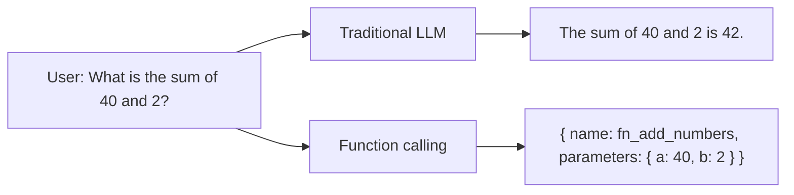

That JSON is what a later system would execute. This program never runs
`40 + 2` in Python.

Why it matters (subject III.2):

- Call APIs, databases, devices
- Execute code and transform data
- Chain steps
- Emit JSON / XML
- Extract structured fields from unstructured text

The hard part (subject III.3): a 0.6B model may emit valid JSON only ~30%
of the time if you only prompt it. Production systems reach 99%+ with the
**same** small model by constraining each next token. Prompting alone is
explicitly not the skill this project asks for.

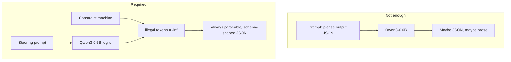

---

## 2. Subject constraints (what you must obey)

| Area | Rule |
|---|---|
| Language | Python 3.10+, flake8, mypy, PEP 257 docstrings, type hints |
| Classes | All classes are pydantic models |
| Allowed extras | `numpy`, `json` |
| Forbidden | dspy, pytorch / huggingface / transformers / outlines **in `src/`** |
| Model | Default `Qwen/Qwen3-0.6B` (others allowed if this still works) |
| Function choice | LLM only — no keyword heuristics |
| SDK | Public API only; no `_model`, `_tokenizer`, … |
| Install | Reviewer / moulinette runs `uv sync` |
| Errors | Never crash; one clear message |
| Makefile | `install`, `run`, `debug`, `clean`, `lint` |
| Output | 100% valid JSON, schema-compliant, 90%+ correct calls, &lt; 5 minutes |

CLI (subject IV.3.2):

```bash
uv run python -m src \
  [--functions_definition <file>] \
  [--input <file>] \
  [--output <file>]
```

Defaults in this repo:

| Flag | Default |
|---|---|
| `--functions_definition` | `data/input/functions_definition.json` |
| `--input` | `data/input/function_calling_tests.json` |
| `--output` | `data/output/function_calling_results.json` |

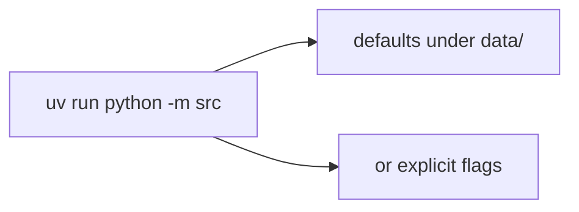

---

## 3. Inputs and output

Reviewers will change the JSON. Nothing is hardcoded from the sample files.

### 3.1 Catalog — `functions_definition.json`

A JSON **array** of tools. You do not execute them. They are a menu + schema.

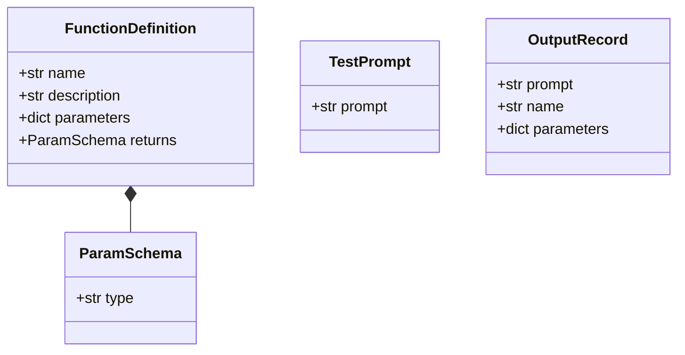

Sample catalog in this checkout:

| Name | Parameters | Returns |
|---|---|---|
| `fn_add_numbers` | `a: number`, `b: number` | number |
| `fn_greet` | `name: string` | string |
| `fn_reverse_string` | `s: string` | string |
| `fn_get_square_root` | `a: number` | number |
| `fn_substitute_string_with_regex` | `source_string`, `regex`, `replacement` (strings) | string |

Parameter names and counts are not fixed. `type` is a string
(`number`, `string`, and later `integer` / `boolean`). `returns` is stored
and never executed.

### 3.2 Tests — `function_calling_tests.json`

A JSON **array** of `{ "prompt": "..." }` only. Eleven sample prompts
(sums, greetings, reverse, square root, regex replace). There is no
`name` and no `parameters` in this file.

### 3.3 Results — `function_calling_results.json`

One object per prompt, **exactly** these keys:

- `prompt` (string) — original request
- `name` (string) — catalog function
- `parameters` (object) — all required args, correct types

Validation (subject V.4.2): valid JSON, no extra keys, no prose, types
match the catalog, all required arguments present.

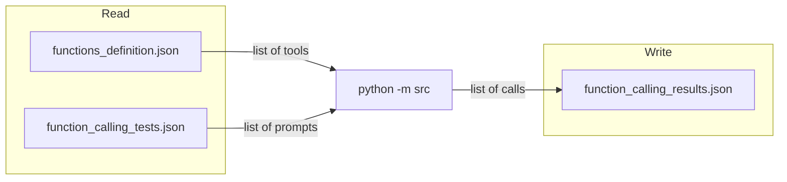

Worked example:

```text
prompt:  What is the sum of 2 and 3?
name:    fn_add_numbers
parameters: { "a": 2.0, "b": 3.0 }
```

`data/output/` is gitignored. Do not commit generated results.

---

## 4. Repository layout

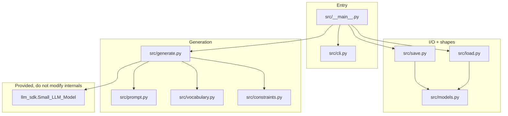

| Path | Role |
|---|---|
| `src/__main__.py` | Glue: parse → load → decode → save |
| `src/cli.py` | Three `Path` flags. Never opens files. |
| `src/models.py` | `ParamSchema`, `FunctionDefinition`, `TestPrompt`, `OutputRecord` |
| `src/load.py` | Open + `json.load` + pydantic. Fail with one stderr line. |
| `src/prompt.py` | Steering text + forced prefix `{"name":"` |
| `src/vocabulary.py` | Token id → UTF-8 text; first-character index |
| `src/constraints.py` | Character-level JSON + schema state machine |
| `src/generate.py` | Encode, logits, mask, argmax loop |
| `src/save.py` | Write the results array |
| `llm_sdk/` | Public wrapper around Qwen (copied next to `src/`) |
| `Makefile` | `install` / `run` / `debug` / `clean` / `lint` |
| `pyproject.toml` + `uv.lock` | `uv sync`; workspace member `llm_sdk` |

`src/call_me_maybe/` is leftover uv scaffolding (`Hello from call-me-maybe!`).
The subject entry point is `python -m src`, not that package.

---

## 5. End-to-end program flow

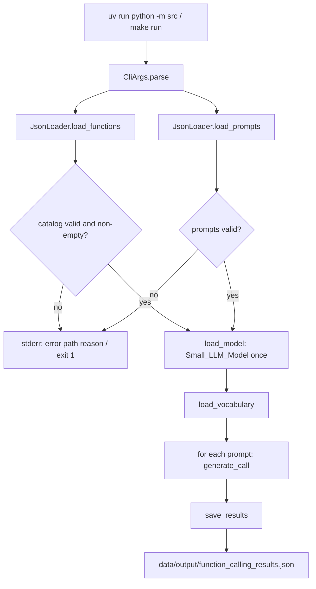

`main` prints how many functions and prompts were loaded, then
`wrote N result(s) to <path>`. Disk write errors become
`error: <path>: cannot write file (...)`.

---

## 6. Loading and validating JSON

CLI stores paths only. `JsonLoader` opens files with a context manager.

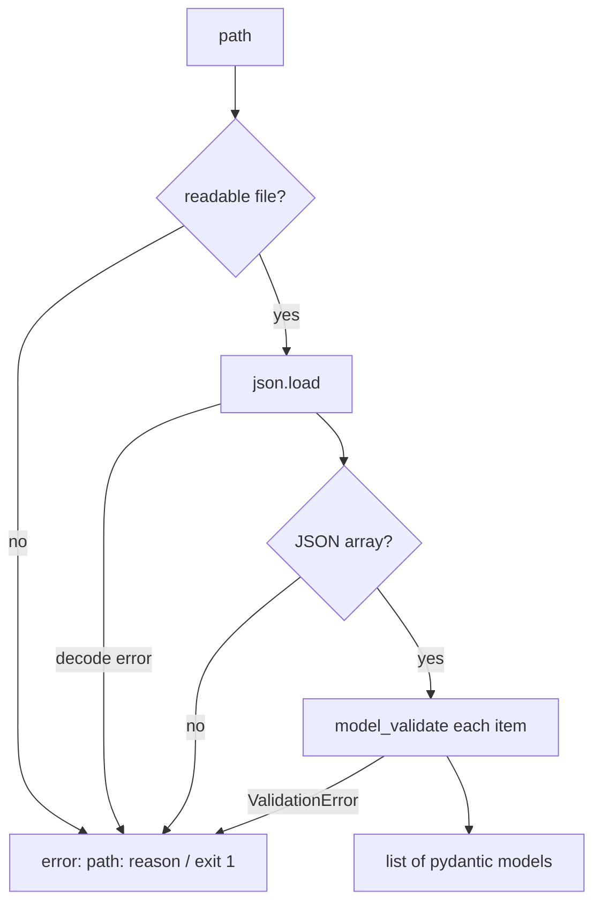

| Situation | Message |
|---|---|
| Missing path | `file not found` |
| Path is a directory | `expected a file, got a directory` |
| Unreadable | `cannot read file (...)` |
| Not JSON | `invalid JSON (...)` |
| Top level not an array | `expected a JSON array of ...` |
| Wrong object shape | `does not match the ... schema` |

The caller chooses the method from the **flag**. Never run
`load_functions()` on the tests file.

---

## 7. The LLM SDK (public surface only)

`Small_LLM_Model` wraps Hugging Face Qwen. `src/` must treat it as a black
box.

| Method | Used? | Meaning |
|---|---|---|
| `encode(text) -> Tensor` | yes | Token ids (2-D tensor). Convert with `.tolist()`. |
| `get_logits_from_input_ids(ids) -> list[float]` | yes | Next-token scores (no softmax) |
| `get_path_to_vocab_file() -> str` | yes | `vocab.json` on disk |
| `get_path_to_tokenizer_file() -> str` | fallback | `tokenizer.json` if vocab path fails |
| `decode(ids) -> str` | optional / unused here | Detokenize. Output is built from vocab text. |
| `get_path_to_merges_file()` | unused | BPE merges |

Device: MPS → CUDA → CPU. First run downloads ~1.5 GB of weights.

Forbidden in `src/`: `_model`, `_tokenizer`, `torch`, `transformers`.

---

## 8. Subject generation pipeline

The model never emits a full answer in one shot. It scores the **next**
token, that token is appended, and the loop repeats.

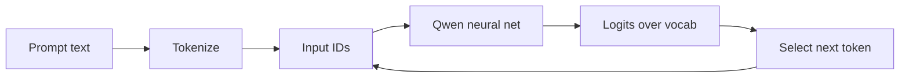

1. **Prompt** — steering text + user request + `{"name":"`
2. **Tokenization** — subwords (BPE). `Ġ` means a leading space.
3. **Input IDs** — integers the model understands.
4. **LLM** — one forward pass.
5. **Logits** — a score per vocabulary entry (~150k).
6. **Selection** — normally argmax; here **after** masking illegal ids to
   `-inf`.

Stop when the JSON object is closed (`Phase.DONE`), not when EOS appears.
Cap: 256 new tokens, then an emergency character fill.

---

## 9. Steering prompt vs decoder

The prompt lists every catalog function (name, description, parameter
types, return type) and the user request. It ends with
`JSON function call:` plus the prefix `{"name":"`.

The SDK has **no chat template**. `encode` receives one plain string.

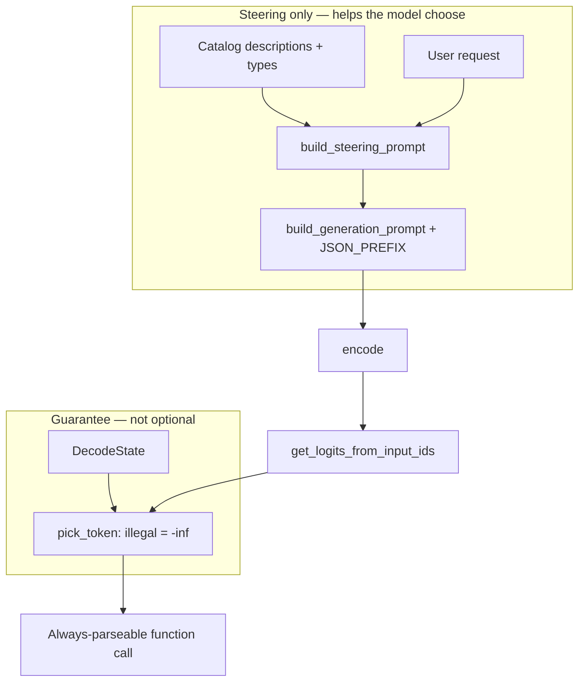

The prompt is not trusted to produce JSON. It only biases *which legal*
function and *which legal* values win.

---

## 10. Constrained decoding (the core skill)

At each step:

1. Ask for logits.
2. Map every candidate token id to text (`vocabulary.py`).
3. Ask `DecodeState.accepts(text)` whether that text stays on a valid path.
4. Copy logits into NumPy, set illegal entries to `-inf`, take argmax.
5. Append the winning id, `advance` the machine, repeat.

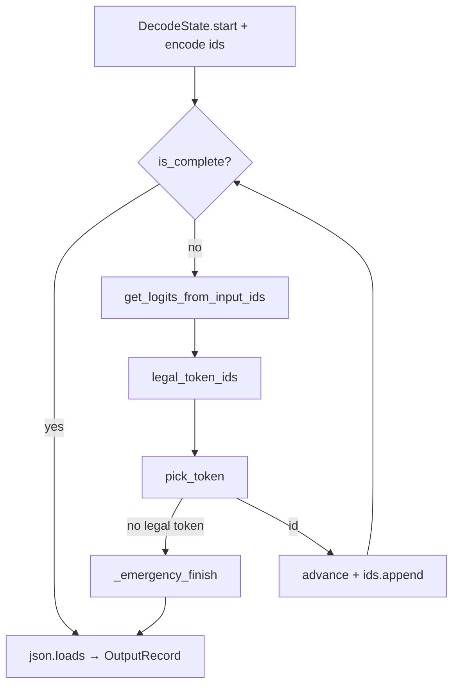

Who decides what:

| Slot | Who | Rule |
|---|---|---|
| Function name | LLM among legal prefixes | `_feed_name` |
| Braces, quotes, keys, colons | Decoder | `_feed_literal` (exact string) |
| Argument values | LLM, typed by schema | `_feed_string` / `_feed_number` / `_feed_bool` |

Keys come from the catalog in **definition order**. The model cannot invent
keys or extra fields.

---

## 11. Constraint machine

Target JSON is a **fixed compact template** (no optional whitespace):

```text
{"name":"<FUNCTION>","parameters":{"<key>":<value>, ...}}
```

Compact JSON shrinks the legal set at structural positions to a handful of
tokens.

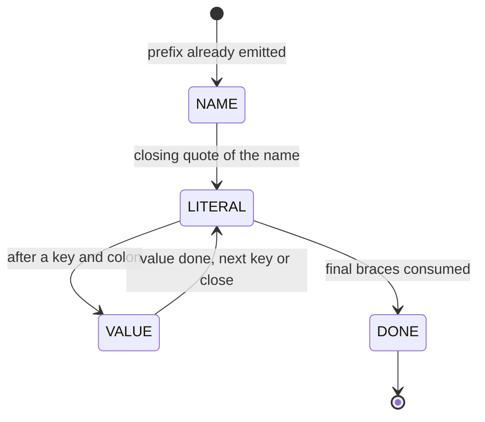

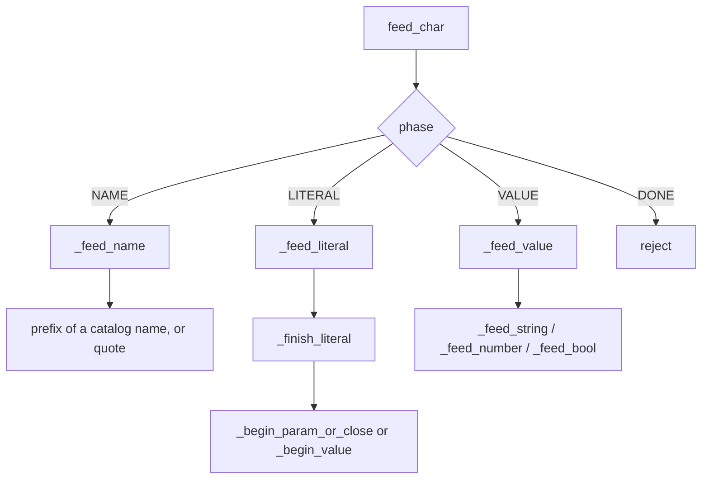

| Phase | Allowed |
|---|---|
| `NAME` | Next character of at least one catalog name, or `"` once the buffer equals a name |
| `LITERAL` | Exact next character of the forced fragment |
| `VALUE` string | `"`, body / escapes (`\"`, `\\`, `\uXXXX`, …), then closing `"` |
| `VALUE` number | optional `-`, digits, optional `.` + digits |
| `VALUE` integer | optional `-`, digits, no `.` |
| `VALUE` boolean | prefix of `true` or `false` |
| After a finished number / bool | `,` or `}` re-dispatched into the next literal |
| `DONE` | Stop |

`normalize_kind` maps catalog type strings:

| Catalog type | Kind |
|---|---|
| `string`, `str` | string |
| `number`, `float`, `double` | number |
| `integer`, `int` | integer |
| `boolean`, `bool` | boolean |
| anything else | string (safe default) |

The machine is **character-level**. Tokens are multi-character. `accepts`
snapshots mutable fields, tries `feed_char` for every character, then
restores. A token such as `2}` can end a number and close the object in
one step.

`allowed_first_chars` lets the vocab layer skip most of the ~150k tokens.
Inside an open string it returns `None` (scan all ids). Everywhere else it
returns a small character set (`f`/`g` during the name, `{`/`"` during
literals, digits during numbers, …).

If the loop hits the token cap or no legal token remains,
`_emergency_finish` writes the remaining legal characters so the JSON
still parses. Values may then be dummy, but the file stays valid JSON.

---

## 12. Vocabulary and byte-level BPE

Qwen stores pieces with the GPT-2 `bytes_to_unicode` map. A leading space
is `Ġ`, not `" "`. Constraint checks need real characters.

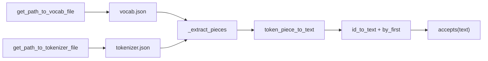

`Vocabulary.candidate_ids(first_chars)` returns only tokens whose text
starts with an allowed character. That is the main speed trick at
structural positions.

---

## 13. Worked example

Prompt: `What is the sum of 2 and 3?`

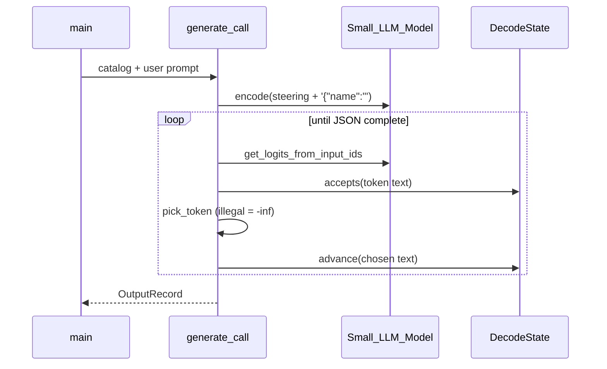

Typical path:

1. Prefix already present: `{"name":"`
2. `NAME` — model emits `fn_add_numbers` (other names stay legal until they diverge)
3. `LITERAL` — forced `,"parameters":{"a":`
4. `VALUE` number — model emits `2` or `2.0`
5. `LITERAL` — forced `,"b":`
6. `VALUE` number — model emits `3`
7. `LITERAL` — forced `}}`
8. `json.loads` → `{prompt, name, parameters}`

The same loop handles `fn_greet` (one string), `fn_reverse_string`,
`fn_get_square_root`, and the three-string regex function.

---

## 14. How the project was built (learning path)

The code grew in layers. Intermediate helpers (`NameState`,
`preview_next_token`, …) were replaced. The current names are
`DecodeState`, `generate_call`, `run_call_decoding`.

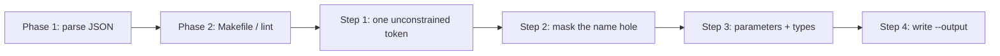

| Phase | What you learn | Current files |
|---|---|---|
| Parse | Flags, pydantic, graceful JSON errors | `cli.py`, `models.py`, `load.py` |
| Wiring | `uv`, flake8, mypy, `.gitignore` | `Makefile`, `pyproject.toml` |
| First contact | prompt → ids → logits → argmax | `generate.py`, `prompt.py` |
| Name masking | illegal = `-inf`; catalog prefixes only | `constraints.py`, `vocabulary.py` |
| Full schema | literals + typed values + phase changes | `DecodeState` |
| Persist | exact output keys | `save.py` |

---

## 15. Quality bar and testing

Subject V.5:

- **90%+** correct function + arguments on the eval set
- **100%** valid, schema-shaped JSON (guaranteed by the mask)
- Process the sample file in **under 5 minutes** after the one-time download
- Graceful handling of missing / malformed inputs

How to check (do not hardcode the sample sentences):

```bash
make install
make run
make lint
uv run python -m src --input /tmp/missing.json
uv run python -m src --functions_definition data/input/function_calling_tests.json
```

Happy path: 5 functions, 11 prompts, 11 output objects. Broken paths: one
stderr line, exit 1, no traceback. Swap catalogs (boolean, integer, extra
parameters) and confirm the file still parses.

Unit tests are local-only and not graded.

---

## 16. Makefile and tooling

| Target | Command |
|---|---|
| `make install` | `uv sync` |
| `make run` | `uv run python -m src` |
| `make debug` | `uv run python -m pdb src/__main__.py` |
| `make clean` | remove `__pycache__`, `.mypy_cache` |
| `make lint` | flake8 + mypy with the subject flags |

`lint` mypy flags: `--warn-return-any --warn-unused-ignores
--ignore-missing-imports --disallow-untyped-defs --check-untyped-defs`.

`.flake8`: line length 100; skip `llm_sdk`. `pyproject.toml` excludes
`llm_sdk` from mypy as well.

`.gitignore`: `.venv`, caches, `data/output/`.

---

## 17. Bonus ideas (subject VII)

Optional, must actually work if claimed:

- Other models besides Qwen3-0.6B
- Recode tokenize/detokenize using only vocab path + logits (avoid `encode` / `decode` in the main path)
- Stronger error recovery
- Caching / batching
- Test suite
- Visualize generation
- Nested argument objects
- Public encode / decode of your own

This checkout implements the mandatory pipeline plus emergency finish and
vocab/tokenizer fallback. It does not implement a custom tokenizer or a
second model.

---

## 18. Defense notes

You may be asked to change a few lines (evaluation chapter VIII). Be able
to explain, without the README:

1. Why prompting alone is not enough.
2. What a logit is and why `-inf` removes a token.
3. Why the machine walks **characters** while the model emits **tokens**.
4. How `Ġ` becomes a space.
5. Why keys are forced and values are free.
6. Why the function is chosen by the LLM, not `if "sum" in prompt`.
7. What happens if an input file is missing or the catalog is empty.

Repository must contain: `src/`, `pyproject.toml`, `uv.lock`, `llm_sdk/`,
`data/input/`, `README.md`. Do not submit `data/output/`.
