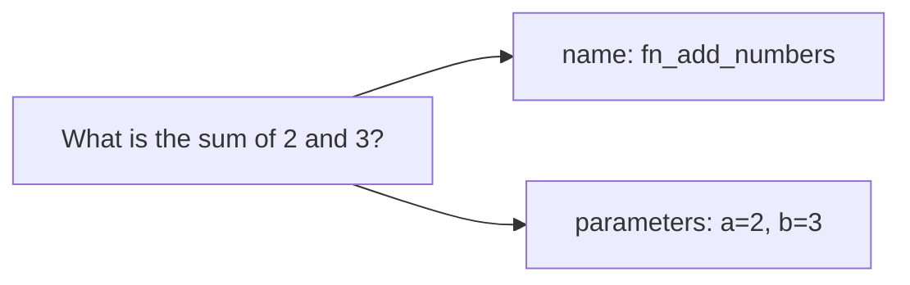
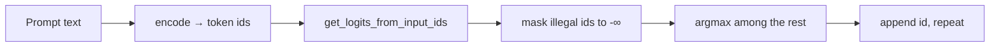
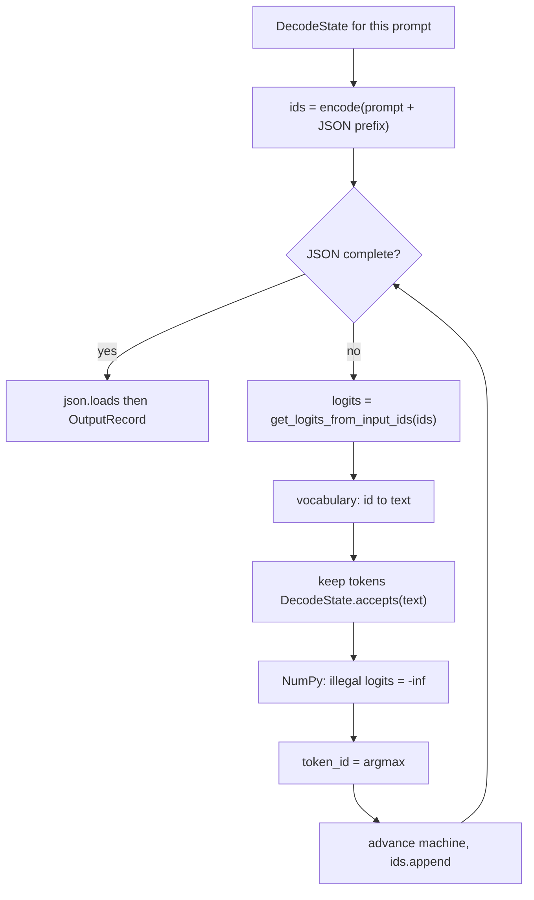
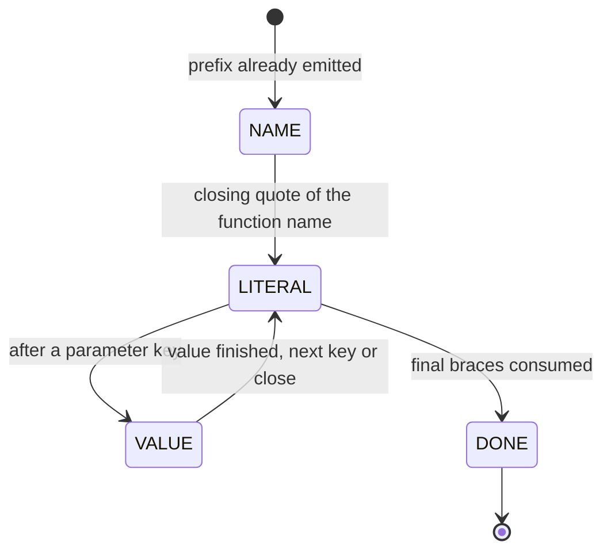
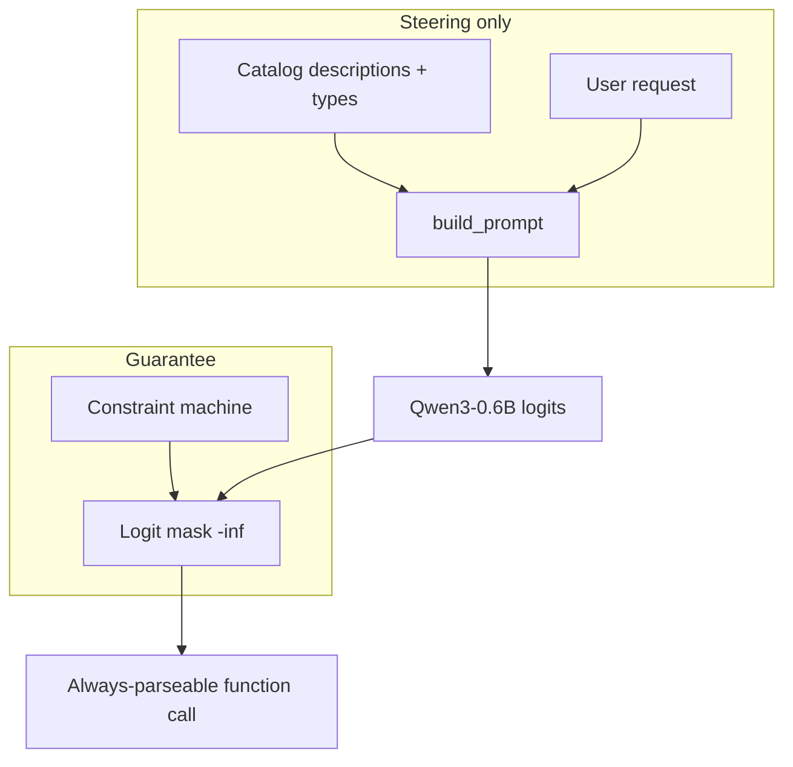
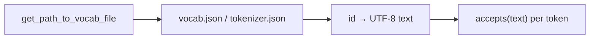

# Call Me Maybe — workflow report

This report describes how the program turns two JSON inputs into one JSON
output. The LLM never answers the user in prose. It only fills holes in a
forced function-call template, token by token.

## 1. Program entry

`uv run python -m src` loads `src/__main__.py`. Flags default to the files
under `data/input/` and `data/output/function_calling_results.json`.

```mermaid
flowchart TD
    A["uv run python -m src"] --> B["cli.py: parse three paths"]
    B --> C["load.py: functions_definition.json"]
    B --> D["load.py: function_calling_tests.json"]
    C --> E{"valid catalog?"}
    D --> F{"valid prompt list?"}
    E -->|no| X["stderr: error path reason / exit 1"]
    F -->|no| X
    E -->|yes| G["decoder.py: one Small_LLM_Model"]
    F -->|yes| G
    G --> H["for each prompt: constrained JSON"]
    H --> I["save.py: write output array"]
    I --> J["data/output/function_calling_results.json"]
```



Both input files are JSON **arrays**, but they have different object shapes.
The catalog is a list of tools (`name`, `description`, `parameters`,
`returns`). The tests file is a list of `{ "prompt": "..." }` objects. The
loader never guesses which file is which: `__main__.py` calls
`load_functions()` on `--functions_definition` and `load_prompts()` on
`--input`.

## 2. What the output is

The program does not compute `2 + 3`. It writes a call the rest of a system
could execute later:



Each output object has exactly three keys: `prompt`, `name`, `parameters`.
`name` must exist in the catalog. Parameter types must match that function
(`number`, `string`, `boolean`, `integer`, …). Extra prose is forbidden.

## 3. LLM pipeline (one next token)

The SDK does not generate a full string. It scores every vocabulary entry for
the **next** token. The subject pipeline is:



`encode` returns a 2-D tensor. The project calls `.tolist()` and never
imports `torch`. `decode` is unused: the output string is built from
vocabulary text, not from detokenizing blindly.

## 4. Constrained decoding

Unconstrained sampling would let the model emit commentary, broken braces, or
the wrong keys. Before argmax, every token that would leave the JSON template
or the active parameter type is removed.



Masking uses NumPy. The model still picks among **legal** tokens, so the
function name and the argument values come from the LLM, not from keyword
`if`/`else` on the English prompt.

## 5. Constraint machine phases

The generated object is compact JSON with no extra spaces:

```text
{"name":"<NAME>","parameters":{"<k1>":<v1>,"<k2>":<v2>}}
```



| Phase | Who decides | What is allowed |
|---|---|---|
| NAME | LLM | Prefixes of catalog names, then `"` |
| LITERAL | Decoder | Exact next fragment (`,"parameters":{`, `"a":`, `}}`, …) |
| VALUE | LLM, typed by schema | JSON string / number / integer / boolean |
| DONE | Decoder | Stop |

Parameter **keys** are copied from the catalog in definition order. The model
does not invent keys. After a number or boolean is complete, `,` or `}` is
treated as the start of the next literal (so a token like `3}` can close both
the value and the object).

## 6. Prompt vs decoder



The prompt tells the model *which* legal function is appropriate. The mask
makes *illegal* JSON impossible. Prompting alone is not the solution the
subject asks for.

## 7. Vocabulary

Qwen stores tokens with a GPT-2-style byte map (`Ġ` is a leading space).
`vocabulary.py` loads `vocab.json` through `get_path_to_vocab_file()`, or
`tokenizer.json` through `get_path_to_tokenizer_file()` if needed, then
reverses that map so constraint checks see real characters.



## 8. File layout

| Path | Role |
|---|---|
| `src/cli.py` | Flags; does not open files |
| `src/load.py` | Read + pydantic validate |
| `src/models.py` | Catalog, prompt, output shapes |
| `src/prompt.py` | Steering text |
| `src/vocabulary.py` | Token id → text |
| `src/constraints.py` | JSON + schema state machine |
| `src/decoder.py` | Logits, mask, argmax loop |
| `src/save.py` | Write the results array |
| `src/__main__.py` | Glue |

The `llm_sdk` package is used as a black box. Private attributes are not
read. `torch` / `transformers` / Hugging Face libraries are not imported
from `src/`.
