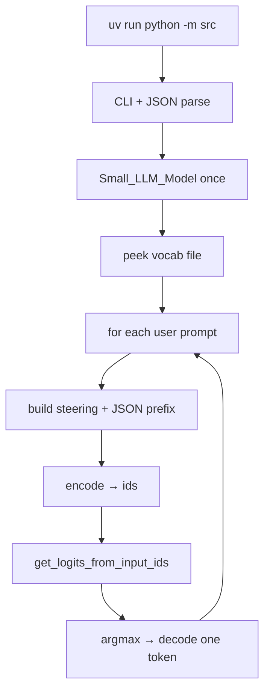
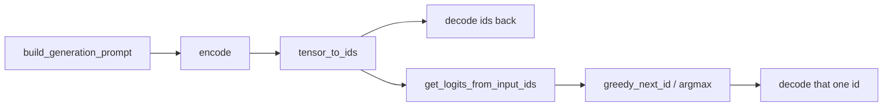
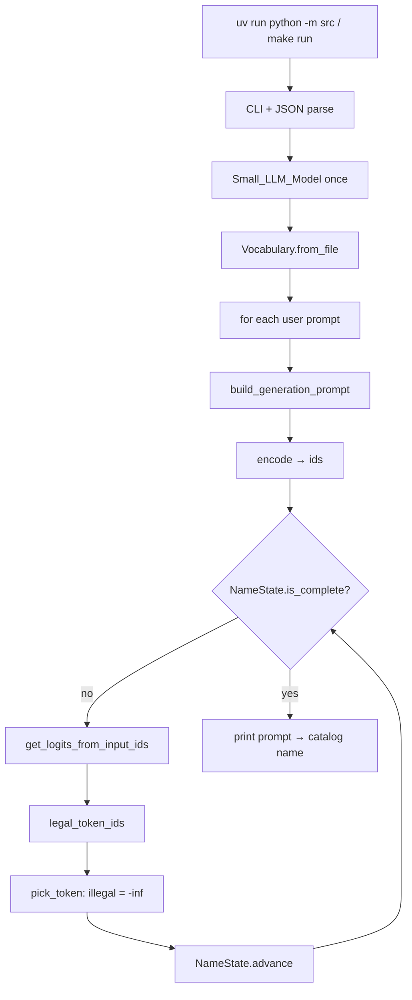
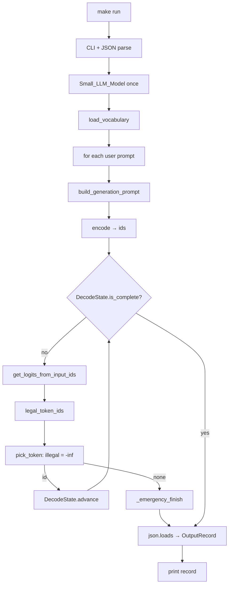
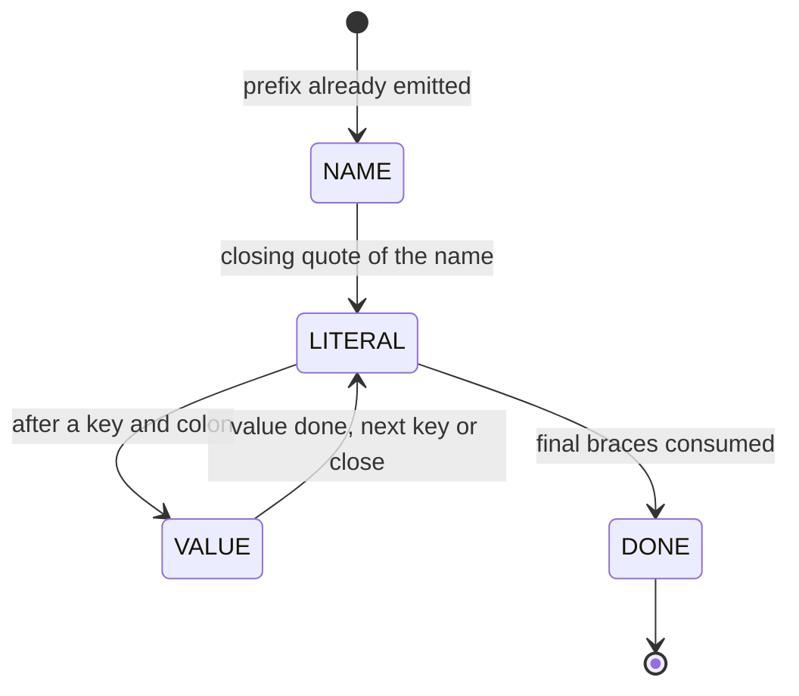
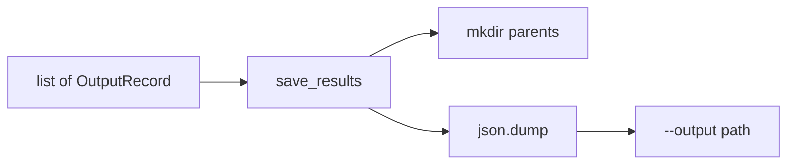

# Steps

How the program grew after parsing. Each section matches the code **as of
that step**. Later sections replace earlier helpers.

Run the current program:

```bash
make install
make run
```

The first run downloads `Qwen/Qwen3-0.6B` (~1.5 GB) from Hugging Face.

---

## Step 1 — first LLM contact

This section is the first LLM wiring: load the catalog and prompts, construct
`Small_LLM_Model` once, encode the steering text plus the user request, then
read **one** unconstrained next-token logit vector.

It did **not** mask illegal tokens. It did **not** loop until JSON is
finished. It did **not** write `--output`.

Those one-shot helpers (`run_first_contact`, `preview_next_token`,
`greedy_next_id`, `peek_special_tokens`) were replaced in step 2.

### What this step is

After parsing you already have typed Python objects. Step 1 turns a prompt
into the LLM pipeline from the subject:

```text
steering text + user request + {"name":"
        → encode → token ids
        → get_logits_from_input_ids
        → argmax
        → one next token
```

The steering text is a **plain completion string**. The SDK has no chat
roles. Calling it a “system prompt” is fine as a nickname; `encode` still
receives one `str`.



### Who does what

| Step | File | Function / method |
|---|---|---|
| Entry | `src/__main__.py` | `main` |
| Flags | `src/cli.py` | `CliArgs.parse` |
| Catalog | `src/load.py` | `JsonLoader.load_functions` |
| Prompts | `src/load.py` | `JsonLoader.load_prompts` |
| Empty catalog | `src/__main__.py` | `main` (stderr + exit 1) |
| Orchestrate this step | `src/generate.py` | `run_first_contact` |
| Construct Qwen | `src/generate.py` | `load_model` |
| Construct Qwen | `llm_sdk` | `Small_LLM_Model.__init__` |
| Vocab path | `llm_sdk` | `get_path_to_vocab_file` |
| Tokenizer fallback | `llm_sdk` | `get_path_to_tokenizer_file` |
| Open vocab JSON | `src/generate.py` | `load_vocab_pieces` |
| Piece table | `src/generate.py` | `load_id_to_piece` |
| Parse vocab / tokenizer JSON | `src/generate.py` | `_extract_pieces` |
| Print `{`, `"`, digit, space, `fn` | `src/generate.py` | `peek_special_tokens` |
| Steering text | `src/prompt.py` | `build_steering_prompt` |
| Add `{"name":"` | `src/prompt.py` | `build_generation_prompt` |
| Prefix constant | `src/prompt.py` | `JSON_PREFIX` |
| One prompt → one token | `src/generate.py` | `preview_next_token` |
| Tensor → `list[int]` | `src/generate.py` | `tensor_to_ids` |
| Tokenize | `llm_sdk` | `Small_LLM_Model.encode` |
| Round-trip text | `llm_sdk` | `Small_LLM_Model.decode` |
| Next-token scores | `llm_sdk` | `get_logits_from_input_ids` |
| Highest logit index | `src/generate.py` | `greedy_next_id` |
| Print one result | `src/generate.py` | `_print_preview` |
| Result shape | `src/generate.py` | `FirstTokenPreview` |
| Catalog / prompt shapes | `src/models.py` | `FunctionDefinition`, `TestPrompt` |

Failures while loading or calling the model printed
`error: LLM contact failed (...)` on stderr and exit 1.

### Step by step

#### 1. Parse (already done)

`main` still starts the same way: three paths from argparse, then two
`JsonLoader` calls. Missing or invalid JSON still fails in `load.py`.

| Piece | File | Function |
|---|---|---|
| Start | `src/__main__.py` | `main` |
| Flags | `src/cli.py` | `CliArgs.parse` |
| Catalog | `src/load.py` | `JsonLoader.load_functions` |
| Prompts | `src/load.py` | `JsonLoader.load_prompts` |

#### 2. Construct the model once

`run_first_contact` called `load_model`, which constructs `Small_LLM_Model()`
with the default `Qwen/Qwen3-0.6B`. This is **once per process**, not once
per prompt.

| Piece | File | Function |
|---|---|---|
| Orchestrator | `src/generate.py` | `run_first_contact` |
| Wrapper | `src/generate.py` | `load_model` |
| SDK | `llm_sdk` | `Small_LLM_Model.__init__` |

Public API only. No `_model`, `_tokenizer`, `torch`, or `transformers` in
`src/`.

#### 3. Look at the vocabulary file

Before generation, `peek_special_tokens` encoded a few short strings and
looked up the raw vocab pieces. Qwen stores a leading space as `Ġ`, not as
a real space. That mapping matters when deciding which tokens are legal JSON.

| Piece | File | Function |
|---|---|---|
| Print samples | `src/generate.py` | `peek_special_tokens` |
| File + table | `src/generate.py` | `load_vocab_pieces` |
| JSON → id map | `src/generate.py` | `load_id_to_piece` |
| vocab vs tokenizer.json | `src/generate.py` | `_extract_pieces` |
| Paths | `llm_sdk` | `get_path_to_vocab_file`, `get_path_to_tokenizer_file` |
| Sample → ids | `llm_sdk` | `Small_LLM_Model.encode` |
| Flatten | `src/generate.py` | `tensor_to_ids` |

#### 4. Build the steering text

For each `TestPrompt`, `build_steering_prompt` lists every catalog function
(name, description, parameter types, return type) and appends the user
request. `build_generation_prompt` then adds the forced prefix
`{"name":"` so the first logits are already inside a JSON object.

| Piece | File | Function |
|---|---|---|
| Instruction + catalog + user | `src/prompt.py` | `build_steering_prompt` |
| Plus JSON start | `src/prompt.py` | `build_generation_prompt` |
| Prefix | `src/prompt.py` | `JSON_PREFIX` |

The model is **not** asked to invent the braces. Later steps force the rest
of the template. This step only starts the string.

#### 5. Encode, logits, one greedy token

`preview_next_token` is the subject pipeline with **no mask**:



| Piece | File | Function |
|---|---|---|
| Whole preview | `src/generate.py` | `preview_next_token` |
| Prompt string | `src/prompt.py` | `build_generation_prompt` |
| 2-D tensor → list | `src/generate.py` | `tensor_to_ids` |
| Tokenize | `llm_sdk` | `Small_LLM_Model.encode` |
| Round-trip | `llm_sdk` | `Small_LLM_Model.decode` |
| Score every vocab id | `llm_sdk` | `get_logits_from_input_ids` |
| Argmax (NumPy) | `src/generate.py` | `greedy_next_id` |
| Typed result | `src/generate.py` | `FirstTokenPreview` |
| Print | `src/generate.py` | `_print_preview` |

`encode` returns a 2-D tensor. `tensor_to_ids` calls `.tolist()` so `src/`
never names a torch type. `get_logits_from_input_ids` wants `list[int]`.

The next token is **unconstrained**. It might be a function-name prefix,
prose, or junk. Masking illegal ids to `-inf` is step 2.

### What you should see (step 1)

1. Catalog signatures and prompt count (parsing).
2. A “loading Qwen…” line.
3. A vocab path and lines like `encode('{') -> ids […] pieces […]`.
4. For each test prompt: id count, a decode snippet, greedy next token.

Output JSON is still not written. `args.output` is only printed.

### What this step is not

- Not constrained decoding (no illegal-token mask)
- Not a generation loop (one logits call per prompt)
- Not writing `data/output/function_calling_results.json`
- Not choosing `fn_add_numbers` with `if "sum" in prompt`

---

## Step 2 — name-hole masking and Makefile

This section is name-only masking: same encode → logits path as step 1,
but illegal tokens are set to `-inf` before argmax, and the loop repeats
until the function name and its closing quote are done.

It did **not** fill `parameters`. It did **not** write `--output`.

`NameState`, `generate_name`, and `run_name_decoding` were replaced in
step 3 by `DecodeState`, `generate_call`, and `run_call_decoding`.

```bash
make install
make run
make lint
```

### What this step is

The prefix `{"name":"` is already in the prompt. The only hole is the
catalog function name, then `"`.

At every step:

1. Ask for logits.
2. Map token ids to text (`Ġ` is a space).
3. Keep only tokens that stay on a catalog name (or close the quote).
4. Copy logits into NumPy, set the rest to `-inf`, take argmax.
5. Append that id, advance the machine, repeat.

```text
{"name":"<FUNCTION>"
```



The model still **chooses** among legal names. There is no `if "sum" in
prompt`. Prose and broken JSON cannot win because their logits are `-inf`.

### Who does what

| Step | File | Function / method |
|---|---|---|
| Entry | `src/__main__.py` | `main` |
| Flags | `src/cli.py` | `CliArgs.parse` |
| Catalog | `src/load.py` | `JsonLoader.load_functions` |
| Prompts | `src/load.py` | `JsonLoader.load_prompts` |
| Empty catalog | `src/__main__.py` | `main` (stderr + exit 1) |
| Orchestrate this step | `src/generate.py` | `run_name_decoding` |
| Construct Qwen | `src/generate.py` | `load_model` |
| Construct Qwen | `llm_sdk` | `Small_LLM_Model.__init__` |
| Vocab path | `llm_sdk` | `get_path_to_vocab_file` |
| Tokenizer fallback | `llm_sdk` | `get_path_to_tokenizer_file` |
| Load id → text | `src/generate.py` | `load_vocabulary` |
| Parse vocab JSON | `src/vocabulary.py` | `Vocabulary.from_file` |
| Piece → UTF-8 | `src/vocabulary.py` | `token_piece_to_text` |
| BPE byte map | `src/vocabulary.py` | `_bytes_to_unicode` |
| Id → text | `src/vocabulary.py` | `Vocabulary.text_of` |
| First-char filter | `src/vocabulary.py` | `Vocabulary.candidate_ids` |
| Steering + prefix | `src/prompt.py` | `build_generation_prompt` |
| Tensor → `list[int]` | `src/generate.py` | `tensor_to_ids` |
| Tokenize | `llm_sdk` | `Small_LLM_Model.encode` |
| Logits | `llm_sdk` | `get_logits_from_input_ids` |
| Name loop | `src/generate.py` | `generate_name` |
| Legal id set | `src/generate.py` | `legal_token_ids` |
| Mask + argmax | `src/generate.py` | `pick_token` |
| Start machine | `src/constraints.py` | `NameState.start` |
| Trial without commit | `src/constraints.py` | `NameState.accepts` |
| Commit text | `src/constraints.py` | `NameState.advance` |
| One character | `src/constraints.py` | `NameState.feed_char` |
| Name / quote rule | `src/constraints.py` | `NameState._feed_name` |
| Allowed first chars | `src/constraints.py` | `NameState.allowed_first_chars` |
| Done? | `src/constraints.py` | `NameState.is_complete` |
| Chosen catalog name | `src/constraints.py` | `NameState.chosen_name` |
| Phases | `src/constraints.py` | `Phase` (`NAME`, `DONE`) |
| Result shape | `src/generate.py` | `NameChoice` |

Failures print `error: name decoding failed (...)` on stderr and exit 1.

### Constraint machine

`NameState` walks **characters**, not tokens. A multi-character token is
legal only if every character is legal in order (`accepts` snapshots state,
tries `feed_char`, then restores).

| Situation | Allowed |
|---|---|
| Name still growing | Next character of at least one catalog name |
| Buffer already equals a catalog name | `"` |
| After `"` | Stop (`Phase.DONE`) |
| Anything else | Rejected (logit `-inf`) |

Example: after `fn_`, both `add_numbers` and `get_square_root` are still
possible. A token starting with `z` is illegal. Once the quote is accepted,
the name is frozen.

### Makefile and wiring

The subject Makefile lives at the repo root. `requires-python` is `>=3.10`.
`.gitignore` excludes `.venv`, `__pycache__`, `.mypy_cache`, and
`data/output/`.

| Target | Command |
|---|---|
| `make install` | `uv sync` |
| `make run` | `uv run python -m src` |
| `make debug` | `uv run python -m pdb src/__main__.py` |
| `make clean` | remove `__pycache__` and `.mypy_cache` |
| `make lint` | `flake8 .` and `mypy .` with the subject flags |

| File | Role |
|---|---|
| `Makefile` | Those five targets |
| `.flake8` | Line length 100; skip `llm_sdk` |
| `pyproject.toml` | `[tool.mypy]` excludes `llm_sdk` |
| `.gitignore` | Caches and generated output |

### What you should see (step 2)

```text
loaded 5 function(s) from data/input/functions_definition.json
...
loaded 11 prompt(s) from data/input/function_calling_tests.json
output will be written later to data/output/function_calling_results.json
loading Qwen/Qwen3-0.6B ...
loaded N vocab entries
decoding name 1/11...
  'What is the sum of 2 and 3?' -> fn_add_numbers (K token(s))
```

Every printed `name` must exist in the catalog. The JSON object is not
finished yet.

### What this step is not

- Not filling parameter values
- Not forcing `,"parameters":{` or the final `}}`
- Not writing `data/output/function_calling_results.json`
- Not choosing the function with keyword `if`/`else`

---

## Step 3 — parameter values

This section is the full JSON object: after the name quote, the same mask
loop continues through the parameters object until the JSON is closed.

It did **not** write `--output`. Records were printed only. Writing the
file is step 4.

### What this step is

The target is compact JSON with no extra spaces:

```text
{"name":"<FUNCTION>","parameters":{"<key>":<value>, ...}}
```

Who decides what:

| Slot | Who | Rule |
|---|---|---|
| Function name | LLM among legal prefixes | `DecodeState._feed_name` |
| Braces, quotes, keys, colons | Decoder | `_feed_literal` (exact string) |
| Argument values | LLM, typed by schema | `_feed_string` / `_feed_number` / `_feed_bool` |

Keys come from the catalog in definition order. The model does not invent
keys.





### Who does what

| Step | File | Function / method |
|---|---|---|
| Entry | `src/__main__.py` | `main` |
| Flags | `src/cli.py` | `CliArgs.parse` |
| Catalog | `src/load.py` | `JsonLoader.load_functions` |
| Prompts | `src/load.py` | `JsonLoader.load_prompts` |
| Orchestrate this step | `src/generate.py` | `run_call_decoding` |
| Construct Qwen | `src/generate.py` | `load_model` |
| Vocab table | `src/generate.py` | `load_vocabulary` |
| One full call | `src/generate.py` | `generate_call` |
| Legal id set | `src/generate.py` | `legal_token_ids` |
| Mask + argmax | `src/generate.py` | `pick_token` |
| Force leftover braces | `src/generate.py` | `_emergency_finish` |
| Steering + prefix | `src/prompt.py` | `build_generation_prompt` |
| Start machine | `src/constraints.py` | `DecodeState.start` |
| Phases | `src/constraints.py` | `Phase` (`NAME`, `LITERAL`, `VALUE`, `DONE`) |
| Catalog type string | `src/constraints.py` | `normalize_kind` |
| Trial without commit | `src/constraints.py` | `DecodeState.accepts` |
| Commit text | `src/constraints.py` | `DecodeState.advance` |
| One character | `src/constraints.py` | `DecodeState.feed_char` |
| Function name | `src/constraints.py` | `DecodeState._feed_name` |
| Forced fragment | `src/constraints.py` | `DecodeState._feed_literal` |
| After a fragment | `src/constraints.py` | `DecodeState._finish_literal` |
| Next key or `}}` | `src/constraints.py` | `DecodeState._begin_param_or_close` |
| Start a typed hole | `src/constraints.py` | `DecodeState._begin_value` |
| String / number / bool | `src/constraints.py` | `_feed_string`, `_feed_number`, `_feed_bool` |
| Close a value | `src/constraints.py` | `DecodeState._commit_value` |
| Typed result | `src/models.py` | `OutputRecord` |
| Open-string vocab scan | `src/vocabulary.py` | `Vocabulary.candidate_ids` (`None` = all ids) |

Failures print `error: constrained decoding failed (...)` on stderr and
exit 1.

### Constraint machine (parameters)

After the name quote, `_feed_name` switches to `LITERAL` with
`,"parameters":{`. Then `_begin_param_or_close` emits `"key":` for the
next catalog parameter (with a leading `,` after the first), or `}}`
when none remain.

| Phase | Allowed |
|---|---|
| `LITERAL` | Exact next character of the forced fragment |
| `VALUE` string | `"`, then body / escapes, then closing `"` |
| `VALUE` number | optional `-`, digits, optional `.` + digits (`number` only) |
| `VALUE` integer | optional `-`, digits, no `.` |
| `VALUE` boolean | prefix of `true` or `false` |
| After a finished number / bool | `,` or `}` re-dispatched into the next literal |

A token such as `2}` can end a number and close the object in one step:
`accepts` walks every character with snapshot/restore.

Inside an open string, `allowed_first_chars` returns `None`, so
`candidate_ids` tests the full vocabulary. Everywhere else it only tests
tokens whose first character is still legal.

### What you should see (step 3)

```text
decoding 1/11...
  {'prompt': 'What is the sum of 2 and 3?', 'name': 'fn_add_numbers', 'parameters': {'a': 2.0, 'b': 3.0}}
```

Each printed object has exactly `prompt`, `name`, and `parameters`. `name`
exists in the catalog. Parameter types match that function.

Output JSON is still not written. `args.output` is only printed.

### What this step is not

- Not writing `data/output/function_calling_results.json`
- Not choosing the function with keyword `if`/`else`

---

## Step 4 — write `--output`

This is the code as it exists **now**. After every prompt has an
`OutputRecord`, `main` writes the JSON array to `--output`.

### What this step is

Default path: `data/output/function_calling_results.json`. Parent
directories are created. The file is a JSON array. Each object has exactly
`prompt`, `name`, and `parameters`.

Disk errors print `error: <path>: cannot write file (...)` and exit 1.
`data/output/` stays gitignored.



### Who does what

| Step | File | Function / method |
|---|---|---|
| Glue | `src/__main__.py` | `main` |
| Decode all prompts | `src/generate.py` | `run_call_decoding` |
| Write array | `src/save.py` | `save_results` |
| Shape | `src/models.py` | `OutputRecord` |
| Flag | `src/cli.py` | `CliArgs.output` |
| Disk error | `src/__main__.py` | `main` (catch `OSError`) |

`save_results` opens the path with a context manager, dumps
`record.model_dump()` for each row, and writes a trailing newline.

### What you should see (step 4)

```text
decoding 1/11...
  {'prompt': 'What is the sum of 2 and 3?', 'name': 'fn_add_numbers', 'parameters': {'a': 2.0, 'b': 3.0}}
...
wrote 11 result(s) to data/output/function_calling_results.json
```

Then:

```bash
cat data/output/function_calling_results.json
```

### What this step is not

- Not choosing the function with keyword `if`/`else`
- Not executing the functions (no `2 + 3` in Python)
