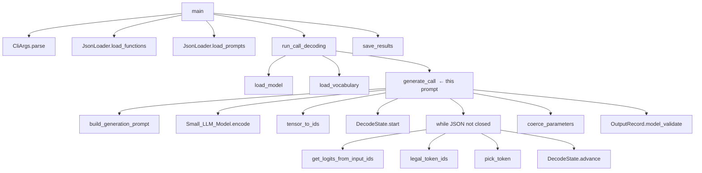
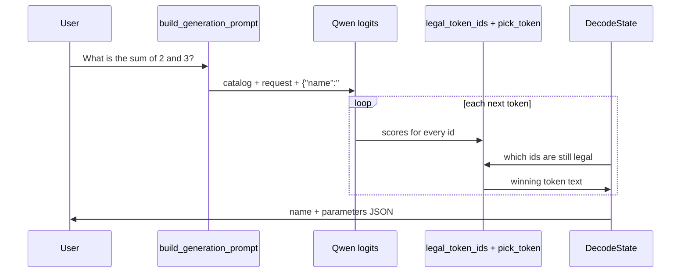

# Walkthrough: one prompt, every function

This file follows a **single** request through the real call stack. Token
ids below are **illustrative** (Qwen’s real splits differ). Phases, files,
and function names match the code as it is now.

---

## The example

**User prompt** (first object in `data/input/function_calling_tests.json`):

```text
What is the sum of 2 and 3?
```

**Catalog tools** the model may name (from `functions_definition.json`):

| Name | Parameters |
|---|---|
| `fn_add_numbers` | `a: number`, `b: number` |
| `fn_greet` | `name: string` |
| `fn_reverse_string` | `s: string` |
| `fn_get_square_root` | `a: number` |
| `fn_substitute_string_with_regex` | three strings |

**What we want written** (the program never computes `5`):

```json
{
  "prompt": "What is the sum of 2 and 3?",
  "name": "fn_add_numbers",
  "parameters": { "a": 2.0, "b": 3.0 }
}
```

You run:

```bash
uv run python -m src
```

That loads `src/__main__.py` and calls `main`.

---

## Call graph (this prompt only)

The real program loops over **all** 11 prompts. Here we pretend the tests
file contains only this one, so the decode loop runs once.



---

## Step 0 — process start

`python -m src` runs `src/__main__.py`. The `if __name__ == "__main__"`
block calls `main`.

| Function | File | Why |
|---|---|---|
| `main` | `src/__main__.py` | Orchestrates parse → load → decode → save |

Nothing is generated yet. `main` does not talk to the LLM.

---

## Step 1 — read the three paths

```python
args = CliArgs.parse()
```

| Function | File | Why |
|---|---|---|
| `CliArgs.parse` | `src/cli.py` | Read `sys.argv`. Store three `Path`s. **Does not open files.** |

With no flags you get:

| Field | Value |
|---|---|
| `args.functions_definition` | `data/input/functions_definition.json` |
| `args.input` | `data/input/function_calling_tests.json` |
| `args.output` | `data/output/function_calling_results.json` |

---

## Step 2 — load and validate JSON

```python
catalog = JsonLoader(path=args.functions_definition).load_functions()
prompts = JsonLoader(path=args.input).load_prompts()
```

| Function | File | Why |
|---|---|---|
| `JsonLoader.load_functions` | `src/load.py` | Treat the catalog path as an array of tools |
| `JsonLoader.load_prompts` | `src/load.py` | Treat the tests path as an array of prompts |
| `JsonLoader._load_list` | `src/load.py` | Shared: “must be a JSON array, then pydantic each item” |
| `JsonLoader.load_raw` | `src/load.py` | `open` + `json.load`. Context manager, no leaked handles |
| `JsonLoader._fail` | `src/load.py` | On any problem: one `error: <path>: …` line, exit 1 |
| `FunctionDefinition.model_validate` | `src/models.py` | Shape: `name`, `description`, `parameters`, `returns` |
| `TestPrompt.model_validate` | `src/models.py` | Shape: `{ "prompt": "..." }` only |

After this, in memory:

- `catalog[0].name == "fn_add_numbers"`
- `catalog[0].parameters["a"].type == "number"`
- `prompts[0].prompt == "What is the sum of 2 and 3?"`

`main` prints the five signatures and the prompt count. If `catalog` is
empty it exits. Then:

```python
records = run_call_decoding(catalog, prompts)
```

---

## Step 3 — load the model and the vocab (once)

`run_call_decoding` runs **once per process**, then loops prompts.

| Function | File | Why |
|---|---|---|
| `run_call_decoding` | `src/generate.py` | Load shared tools, decode every prompt, catch failures |
| `load_model` | `src/generate.py` | Construct `Small_LLM_Model()` (Qwen3-0.6B). First run downloads weights |
| `Small_LLM_Model.__init__` | `llm_sdk` | Load tokenizer + weights onto CPU / CUDA / MPS |
| `load_vocabulary` | `src/generate.py` | Turn the tokenizer file into our `Vocabulary` table |
| `Small_LLM_Model.get_path_to_vocab_file` | `llm_sdk` | Path to `vocab.json` |
| `Small_LLM_Model.get_path_to_tokenizer_file` | `llm_sdk` | Fallback path to `tokenizer.json` |
| `Vocabulary.from_file` | `src/vocabulary.py` | Parse the JSON, fill `id_to_text`, `by_first`, `all_ids` |
| `_extract_pieces` | `src/vocabulary.py` | Handle both `vocab.json` and `tokenizer.json` layouts |
| `token_piece_to_text` | `src/vocabulary.py` | Decode BPE glyphs (`Ġ` → space) into real UTF-8 |
| `_bytes_to_unicode` | `src/vocabulary.py` | GPT-2 / Qwen byte map used by `token_piece_to_text` |

After this you have:

- `model` — can `encode` text and score the next token
- `vocab` — can answer “id 20 is the string `2`”

Logits are **not** in `vocab`. They will appear later, one list per step.

Then the loop hits our prompt:

```python
record = generate_call(model, vocab, functions, item.prompt)
```

`item.prompt` is `What is the sum of 2 and 3?`.

---

## Step 4 — build the text the model will see

Inside `generate_call`:

```python
prompt = build_generation_prompt(functions, user_prompt)
```

| Function | File | Why |
|---|---|---|
| `generate_call` | `src/generate.py` | One user sentence → one `OutputRecord` |
| `build_generation_prompt` | `src/prompt.py` | Steering text + forced prefix `{"name":"` |
| `build_steering_prompt` | `src/prompt.py` | Instruction + catalog list + user request |

The string looks like this (shortened):

```text
Translate the user request into a JSON function call.
Use exactly one function from the list below.

Available functions:
- fn_add_numbers: Add two numbers together and return their sum.
  parameters: a: number, b: number
  returns: number
- fn_greet: ...
...

User request:
What is the sum of 2 and 3?

JSON function call:
{"name":"
```

That last line is `JSON_PREFIX`. The braces are **already started**. The
model is not asked to invent `{` or `"name":`. It only fills holes.

This text only **steers** which legal function wins. It does not guarantee
JSON. The mask does that.

---

## Step 5 — turn that text into token ids

```python
ids = tensor_to_ids(model.encode(prompt))
state = DecodeState.start(functions)
```

| Function | File | Why |
|---|---|---|
| `Small_LLM_Model.encode` | `llm_sdk` | Tokenizer: string → 2-D tensor of ids |
| `tensor_to_ids` | `src/generate.py` | `.tolist()` flatten to `list[int]`. Never import `torch` |
| `DecodeState.start` | `src/constraints.py` | New machine. `generated` already equals `{"name:"` |

`ids` is the whole steering prompt as numbers. Each new generated token
will be **appended** to this list.

`state` starts in phase `NAME`. Next legal characters are prefixes of
catalog names: `f` from every `fn_…` function.

```text
generated:  {"name":"
phase:      NAME
name_buffer: (empty)
chosen_index: None
```

---

## Step 6 — the generation loop (token by token)

This is the heart. Same four calls until `state.is_complete()`:

```python
logits = model.get_logits_from_input_ids(ids)
legal = legal_token_ids(state, vocab, len(logits))
token_id = pick_token(logits, legal)
state.advance(vocab.text_of(token_id))
ids.append(token_id)
```

| Function | File | Why |
|---|---|---|
| `DecodeState.is_complete` | `src/constraints.py` | Stop when phase is `DONE` (object closed) |
| `Small_LLM_Model.get_logits_from_input_ids` | `llm_sdk` | Score every next-token id. Returns `list[float]` |
| `legal_token_ids` | `src/generate.py` | Keep only ids that stay on a valid JSON path |
| `DecodeState.allowed_first_chars` | `src/constraints.py` | Cheap filter: which first characters are still legal |
| `Vocabulary.candidate_ids` | `src/vocabulary.py` | Ids whose text starts with those characters (`by_first`) |
| `Vocabulary.text_of` | `src/vocabulary.py` | Id → the string that token would append |
| `DecodeState.accepts` | `src/constraints.py` | Trial-run the whole token, then restore state |
| `DecodeState._snapshot` / `_restore` | `src/constraints.py` | Copy / put back machine fields so a rejected token does nothing |
| `DecodeState.feed_char` | `src/constraints.py` | Accept or reject **one** character; dispatch on `phase` |
| `pick_token` | `src/generate.py` | Copy logits, set illegal ids to `-inf`, take argmax |
| `DecodeState.advance` | `src/constraints.py` | Commit the winning token for real (`record=True`) |

`accepts` walks **characters**. The model emits **tokens** (often several
characters). A token is legal only if every character in order is legal.

Below is a plausible path for this prompt. Real Qwen may emit `fn_add`
as one token or as `fn` + `_add` + `_numbers`. The functions are the same.

### 6a — NAME: choose the function

`generated` is `{"name:"`.

`allowed_first_chars` → `{ "f" }` (every catalog name starts with `fn_`).

`candidate_ids({"f"})` → only tokens starting with `f`.
`hello`, `2`, `}` are not even tested.

The model still **chooses** among legal prefixes. After `fn_`, both
`fn_add_numbers` and `fn_get_square_root` are still possible. A token
starting with `z` has logit `-inf`.

Suppose the winning pieces are `fn_add_numbers` then `"`.

| After these tokens | `generated` | Phase | Notes |
|---|---|---|---|
| `fn_add_numbers` | `{"name":"fn_add_numbers` | `NAME` | `name_buffer` matches catalog[0] |
| `"` | `{"name":"fn_add_numbers"` | `LITERAL` | `chosen_index = 0`, `literal_rest = ',"parameters":{'` |

Functions that fire here:

| Function | Why |
|---|---|
| `DecodeState._feed_name` | Accept next char of a catalog name, or the closing quote |
| `DecodeState._chosen` | Later: return `fn_add_numbers` from `chosen_index` |

No `if "sum" in prompt`. The English only influenced the **logits**.
Illegal names never survive the mask.

### 6b — LITERAL: force `,"parameters":{"a":`

The model’s favorite token might be a space or the word `parameters`.
Those ids are illegal. Only the exact next character of
`,"parameters":{` then `"a":` can win.

| Function | Why |
|---|---|
| `DecodeState._feed_literal` | Next char must equal `literal_rest[0]` |
| `DecodeState._finish_literal` | When `literal_rest` is empty, decide the next hole |
| `DecodeState._begin_param_or_close` | Emit `"a":` (first key) or `}}` if no keys left |
| `DecodeState._begin_value` | Switch to `VALUE`, set `kind` from the catalog |

| Function | Why |
|---|---|
| `normalize_kind` | Map `"number"` → `ParamKind.NUMBER` |

After this fragment:

```text
generated: {"name":"fn_add_numbers","parameters":{"a":
phase:     VALUE
kind:      NUMBER
param_index: 0
```

The key `"a"` was **copied from the catalog**. The model did not invent it.

### 6c — VALUE: fill `a`

`allowed_first_chars` → `-` and digits.

Tokens like `"hello"` are rejected. `2`, `2.0`, `2}` (digit then closer)
can be legal.

| Function | Why |
|---|---|
| `DecodeState._feed_value` | Dispatch to string / number / bool |
| `DecodeState._feed_number` | Optional `-`, digits, optional `.` + digits; then `,` or `}` |
| `DecodeState._number_complete` | Need at least one digit; if there is a `.`, need a fraction digit |
| `DecodeState._value_terminators` | Last param → `}`; otherwise `,` |
| `DecodeState._commit_value` | This argument is done; bump `param_index` |

Suppose the model emits `2`. Then `_commit_value` → `_begin_param_or_close`
sets `literal_rest` to `,"b":`.

```text
generated: {"name":"fn_add_numbers","parameters":{"a":2
```

### 6d — LITERAL: force `,"b":`

Same `_feed_literal` path. Then `_begin_value` for `b` (`number` again).

```text
generated: {"name":"fn_add_numbers","parameters":{"a":2,"b":
phase:     VALUE
param_index: 1
```

### 6e — VALUE: fill `b`, then close

The model emits `3`. This is the **last** parameter, so the terminator is
`}`. Then `_begin_param_or_close` sees no keys left and sets
`literal_rest = "}}"` (`}` closes `parameters`, `}` closes the object).

A single token `3}` is also legal: `accepts` walks `3` (number), commits,
then feeds `}` into the following literal.

After `}}`:

```text
generated: {"name":"fn_add_numbers","parameters":{"a":2,"b":3}}
phase:     DONE
```

`is_complete()` is true. The `while` loop stops.

If the loop hit 256 tokens or no legal token remained,
`_emergency_finish` would force leftover legal characters so the JSON
still parses. On this happy path it is not needed.

| Function | Why |
|---|---|
| `_emergency_finish` | Last-resort: pick the first allowed character until `DONE` |

---

## Step 7 — turn the string into an `OutputRecord`

```python
parsed = json.loads(state.generated)
chosen = next((item for item in functions if item.name == name), None)
return OutputRecord.model_validate({
    "prompt": user_prompt,
    "name": name,
    "parameters": coerce_parameters(chosen, parsed.get("parameters")),
})
```

| Function | File | Why |
|---|---|---|
| `json.loads` | stdlib | Parse `state.generated`. Must succeed: mask kept it valid |
| `coerce_parameters` | `src/constraints.py` | Apply catalog types to each argument |
| `coerce_parameter_value` | `src/constraints.py` | `number` → `float` (`2` becomes `2.0`); `integer` stays `int` |
| `normalize_kind` | `src/constraints.py` | Catalog `"number"` → `ParamKind.NUMBER` |
| `OutputRecord.model_validate` | `src/models.py` | Typed object: `prompt`, `name`, `parameters` |

`json.loads` would give `{"a": 2, "b": 3}` (ints). The catalog says
`number`, so coerce turns them into `2.0` and `3.0`.

Result:

```python
OutputRecord(
    prompt="What is the sum of 2 and 3?",
    name="fn_add_numbers",
    parameters={"a": 2.0, "b": 3.0},
)
```

`run_call_decoding` prints it and appends it to `records`.

---

## Step 8 — write the file

Back in `main`:

```python
save_results(args.output, records)
```

| Function | File | Why |
|---|---|---|
| `save_results` | `src/save.py` | Create parent dirs, `json.dump` the array, trailing newline |
| `OutputRecord.model_dump` | pydantic | Dict with exactly `prompt`, `name`, `parameters` |

`data/output/function_calling_results.json` (one prompt only):

```json
[
  {
    "prompt": "What is the sum of 2 and 3?",
    "name": "fn_add_numbers",
    "parameters": {
      "a": 2.0,
      "b": 3.0
    }
  }
]
```

`main` prints `wrote 1 result(s) to data/output/function_calling_results.json`.
If the disk write fails, it prints `error: <path>: cannot write file (...)`
and exits 1.

---

## Who decided what (this example)



| Piece of output | Who chose it |
|---|---|
| `{"name":"` | Decoder (already in the prompt) |
| `fn_add_numbers` | LLM, among catalog name prefixes |
| `,"parameters":{"a":` | Decoder (forced literal + first catalog key) |
| `2` | LLM, among legal JSON numbers |
| `,"b":` | Decoder (forced literal + second catalog key) |
| `3` | LLM, among legal JSON numbers |
| `}}` | Decoder (forced close) |
| `2.0` / `3.0` in the file | `coerce_parameters` after `json.loads` |

---

## Function index (this walk)

| Function | Role in this example |
|---|---|
| `main` | Start to finish |
| `CliArgs.parse` | Default paths |
| `JsonLoader.load_functions` / `load_prompts` | Read catalog + this prompt |
| `JsonLoader.load_raw` / `_load_list` / `_fail` | Open, validate, or exit 1 |
| `run_call_decoding` | Model + vocab once, then this prompt |
| `load_model` | Construct Qwen |
| `load_vocabulary` / `Vocabulary.from_file` | Id ↔ text table |
| `token_piece_to_text` | `Ġ` → space |
| `generate_call` | This sentence → one record |
| `build_steering_prompt` / `build_generation_prompt` | Text the model encodes |
| `Small_LLM_Model.encode` | Text → ids |
| `tensor_to_ids` | Tensor → `list[int]` |
| `DecodeState.start` | Machine at `{"name":"` |
| `get_logits_from_input_ids` | Next-token scores |
| `legal_token_ids` | Legal ids only |
| `allowed_first_chars` / `candidate_ids` / `text_of` | Vocab filter |
| `accepts` / `feed_char` / `advance` | Character rules + commit |
| `_feed_name` / `_feed_literal` / `_feed_number` | Phase-specific rules |
| `_begin_param_or_close` / `_begin_value` / `_commit_value` | Move between holes |
| `normalize_kind` | `"number"` → number kind |
| `pick_token` | Best **legal** logit |
| `coerce_parameters` / `coerce_parameter_value` | `2` → `2.0` |
| `OutputRecord.model_validate` | Typed result |
| `save_results` | Write the JSON file |
