# Workflow

How `uv run python -m src` turns two JSON files into one array of function
calls. Each step lists the **file** and the **function** that does the work.

## Big picture

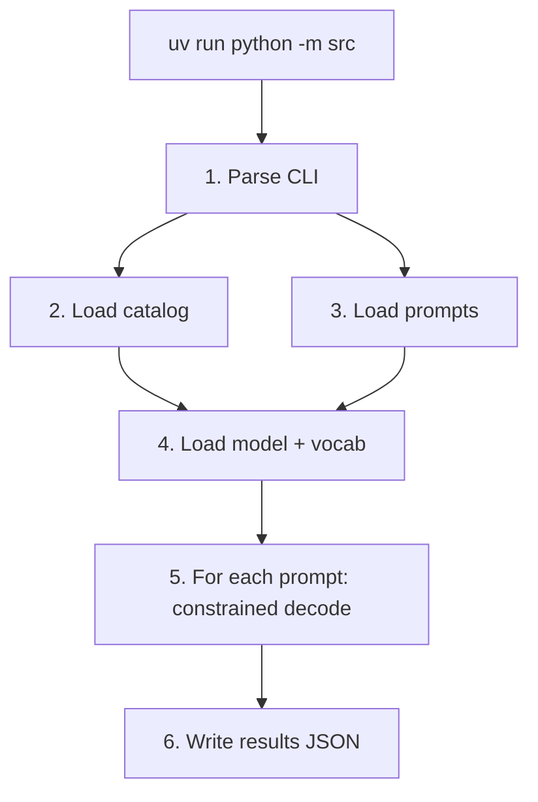

| Step | File | Function |
|---|---|---|
| Entry | `src/__main__.py` | `main` |
| CLI | `src/cli.py` | `CliArgs.parse` |
| Catalog | `src/load.py` | `JsonLoader.load_functions` |
| Prompts | `src/load.py` | `JsonLoader.load_prompts` |
| Pipeline | `src/decoder.py` | `run_pipeline` → `decode_all` |
| One call | `src/decoder.py` | `generate_call` |
| Write | `src/save.py` | `save_results` |

---

## Step 1 — Parse flags

`python -m src` runs `src/__main__.py`, which calls `main`. `main` does not
open files yet. It only asks argparse for three paths.

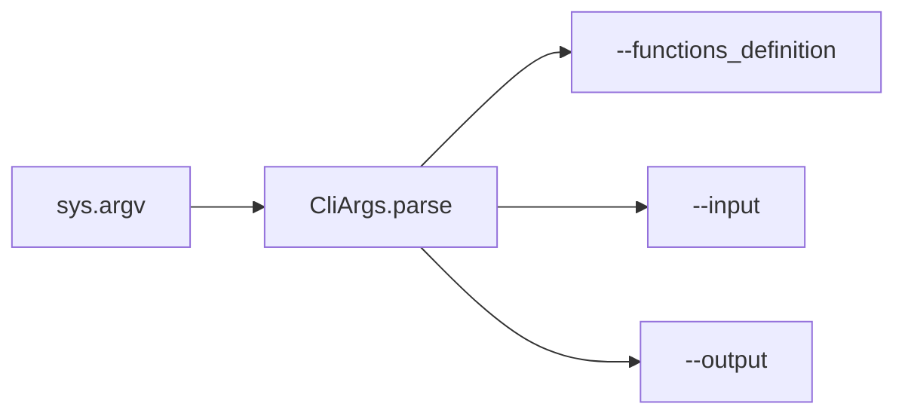

| Piece | File | Function / class |
|---|---|---|
| Start | `src/__main__.py` | `main` |
| Flags | `src/cli.py` | `CliArgs.parse` |
| Result | `src/cli.py` | `CliArgs` (pydantic) |

Defaults if a flag is omitted:

- catalog: `data/input/functions_definition.json`
- prompts: `data/input/function_calling_tests.json`
- output: `data/output/function_calling_results.json`

---

## Step 2 — Load and validate JSON

`main` builds a `JsonLoader` per path. The catalog and the tests file are both
arrays, but the objects inside them have different fields, so they use
different pydantic models from `src/models.py`.

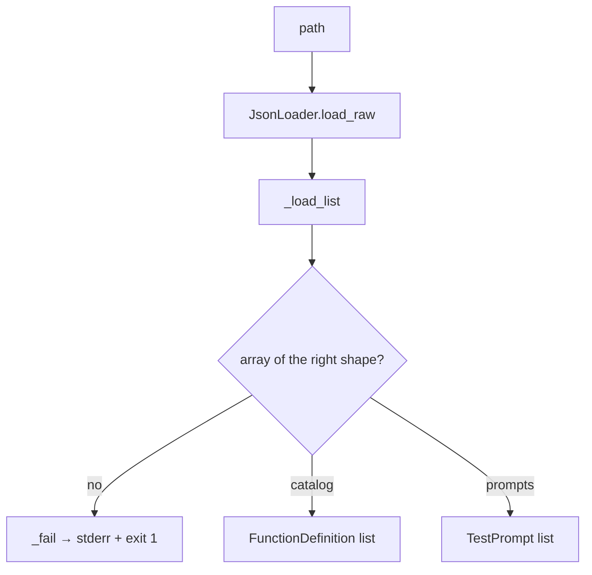

| Piece | File | Function / class |
|---|---|---|
| Open + `json.load` | `src/load.py` | `JsonLoader.load_raw` |
| Array + pydantic | `src/load.py` | `JsonLoader._load_list` |
| Catalog | `src/load.py` | `JsonLoader.load_functions` |
| Prompts | `src/load.py` | `JsonLoader.load_prompts` |
| Error line | `src/load.py` | `JsonLoader._fail` |
| Catalog shape | `src/models.py` | `FunctionDefinition`, `ParamSchema` |
| Prompt shape | `src/models.py` | `TestPrompt` |

Missing file, bad JSON, or wrong schema: one line
`error: <path>: <reason>` on stderr, exit 1. Empty catalog also fails in
`main`.

---

## Step 3 — Load the LLM and the vocabulary (once)

`main` calls `run_pipeline`, which wraps `decode_all` so any later exception
becomes `error: constrained decoding failed (...)`.

`decode_all` constructs **one** `Small_LLM_Model` (Qwen3-0.6B) and one
vocabulary table, then loops over prompts.

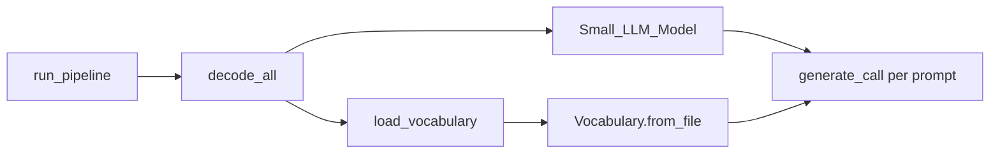

| Piece | File | Function |
|---|---|---|
| Catch errors | `src/decoder.py` | `run_pipeline` |
| Shared model | `src/decoder.py` | `decode_all` |
| LLM wrapper | `llm_sdk` | `Small_LLM_Model.__init__` |
| Vocab path | `llm_sdk` | `get_path_to_vocab_file` (fallback: `get_path_to_tokenizer_file`) |
| Load table | `src/decoder.py` | `load_vocabulary` |
| Parse vocab JSON | `src/vocabulary.py` | `Vocabulary.from_file` |
| Piece → UTF-8 | `src/vocabulary.py` | `token_piece_to_text` |
| BPE byte map | `src/vocabulary.py` | `_bytes_to_unicode` |

`Ġ` in `vocab.json` is a space. That mapping is required so constraint checks
see real characters, not tokenizer glyphs.

Public SDK only: `encode`, `get_logits_from_input_ids`, path helpers. No
`_model` / `_tokenizer`.

---

## Step 4 — Build the steering prompt

For each `TestPrompt`, `generate_call` builds text that lists every catalog
function (name, description, parameter types) plus the user request, then
appends the JSON prefix `{"name":"`.

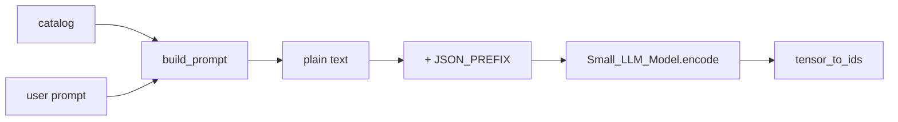

| Piece | File | Function |
|---|---|---|
| Text | `src/prompt.py` | `build_prompt` |
| Prefix constant | `src/constraints.py` | `JSON_PREFIX` |
| Tokenize | `llm_sdk` | `Small_LLM_Model.encode` |
| Tensor → `list[int]` | `src/decoder.py` | `tensor_to_ids` |
| Start machine | `src/constraints.py` | `DecodeState.start` |

The prompt only **steers** which legal function and values the model prefers.
JSON syntax is not trusted to the prompt; the next step forbids illegal
tokens.

---

## Step 5 — Constrained decoding loop

This is the core. Until the JSON object is closed (or 256 new tokens),
`generate_call` does:

1. Ask the model for next-token logits.
2. Keep only tokens the constraint machine would accept.
3. Set every other logit to `-inf` (NumPy).
4. Take argmax, append that id, advance the machine.

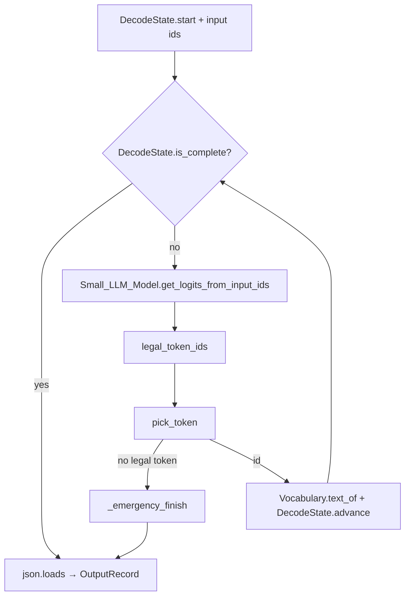

| Piece | File | Function |
|---|---|---|
| Loop | `src/decoder.py` | `generate_call` |
| Logits | `llm_sdk` | `Small_LLM_Model.get_logits_from_input_ids` |
| First-char filter | `src/vocabulary.py` | `Vocabulary.candidate_ids` |
| Id → text | `src/vocabulary.py` | `Vocabulary.text_of` |
| Legal set | `src/decoder.py` | `legal_token_ids` |
| Trial without commit | `src/constraints.py` | `DecodeState.accepts` |
| Mask + argmax | `src/decoder.py` | `pick_token` |
| Commit text | `src/constraints.py` | `DecodeState.advance` |
| Done? | `src/constraints.py` | `DecodeState.is_complete` |
| Force leftover braces | `src/decoder.py` | `_emergency_finish` |
| Typed result | `src/models.py` | `OutputRecord.model_validate` |

`legal_token_ids` asks `DecodeState.allowed_first_chars` so it does not test
all ~150k tokens when only a few first characters are legal (for example `{`
is already emitted, so NAME only allows letters that continue catalog names).

---

## Step 6 — Constraint machine (inside each token)

The target is compact JSON with no extra spaces:

```text
{"name":"<FUNCTION>","parameters":{"<key>":<value>, ...}}
```

`DecodeState` walks this **character by character**. A multi-character token
is legal only if every character is legal in order (`accepts` snapshots state,
tries `feed_char`, then restores).

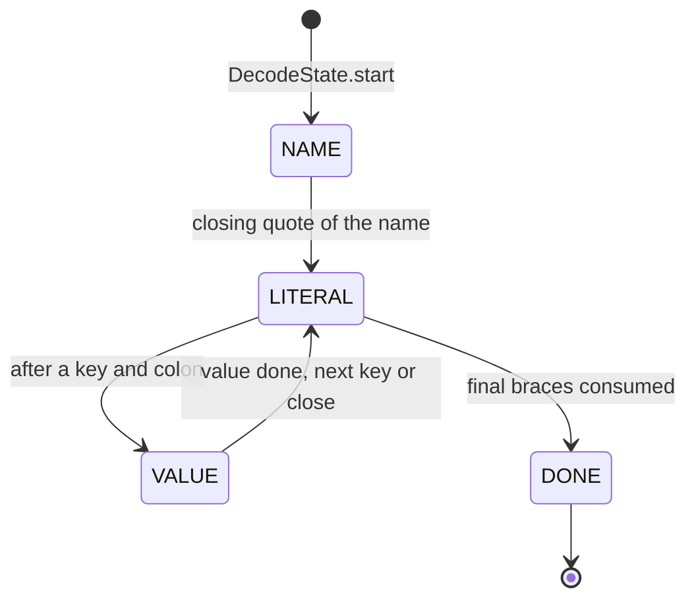

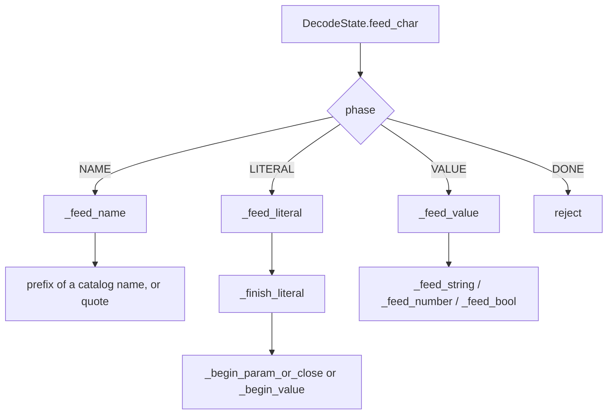

| Piece | File | Function |
|---|---|---|
| Phases | `src/constraints.py` | `Phase` (`NAME`, `LITERAL`, `VALUE`, `DONE`) |
| One character | `src/constraints.py` | `DecodeState.feed_char` |
| Function name | `src/constraints.py` | `DecodeState._feed_name` |
| Forced fragment | `src/constraints.py` | `DecodeState._feed_literal` |
| After a fragment | `src/constraints.py` | `DecodeState._finish_literal` |
| Next `"key":` or `}}` | `src/constraints.py` | `DecodeState._begin_param_or_close` |
| Start a typed hole | `src/constraints.py` | `DecodeState._begin_value` |
| Catalog type string | `src/constraints.py` | `normalize_kind` |
| String / number / bool | `src/constraints.py` | `_feed_string`, `_feed_number`, `_feed_bool` |
| Close a value | `src/constraints.py` | `DecodeState._commit_value` |

Who decides what:

| Slot | Who | Rule |
|---|---|---|
| Function name | LLM among legal prefixes | `_feed_name` |
| Braces, quotes, keys, colons | Decoder | `_feed_literal` (exact string) |
| Argument values | LLM, typed by schema | `_feed_value` |

After a finished number or boolean, `,` or `}` is **re-dispatched** into the
next literal, so a token such as `3}` can end the value and close the object
in one step.

Keys are taken from the catalog in definition order. The model does not invent
keys.

---

## Step 7 — Write the output file

When every prompt has an `OutputRecord`, `main` calls `save_results`. Parent
directories are created. The file is a JSON array with exactly `prompt`,
`name`, and `parameters` on each object.

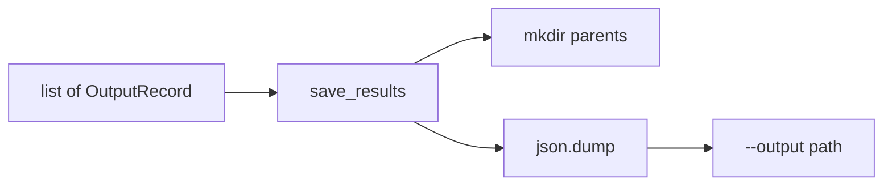

| Piece | File | Function / class |
|---|---|---|
| Write | `src/save.py` | `save_results` |
| Shape | `src/models.py` | `OutputRecord` |
| Disk error | `src/__main__.py` | `main` (catch `OSError`) |

---

## Worked example

Prompt: `What is the sum of 2 and 3?`

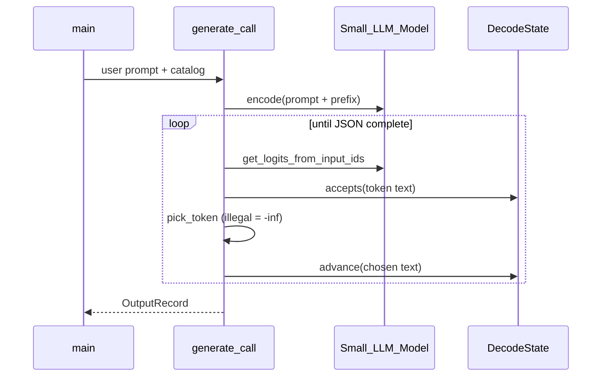

Typical machine path:

1. Prefix already in the prompt: `{"name":"`
2. NAME: model emits `fn_add_numbers` (other names are still allowed until
   they diverge)
3. LITERAL: forced `,"parameters":{"a":`
4. VALUE number: model emits `2` (or `2.0`)
5. LITERAL: forced `,"b":`
6. VALUE number: model emits `3`
7. LITERAL: forced `}}`
8. `json.loads` → `{prompt, name: fn_add_numbers, parameters: {a, b}}`

---

## File map

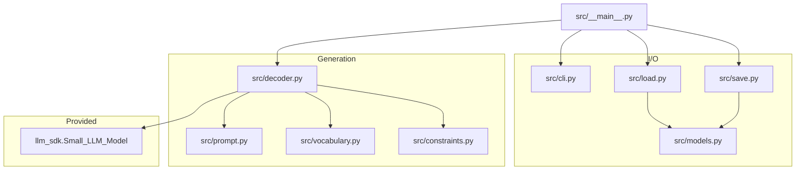
